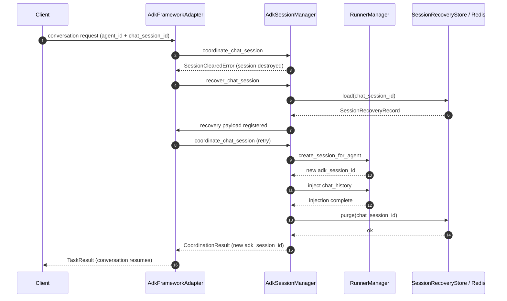

# ADK Lifecycle Strategy (Sessions, Runners, Agents)

## Background & Objectives

Our current ADK integration intentionally supports **controlled reuse** of chat sessions, ADK runners, and domain agents to reduce rehydration cost. At the business layer we keep a stable `chat_session_id` so that callers can switch agents while preserving history. Reuse improves latency and spend, but it also requires well-defined cleanup and recovery mechanics; otherwise, idle sessions leak resources or resurrect with inconsistent state. We need a strategy that balances the following goals:

- **Continuity** – Preserve business context during reuse so one agent/runner can keep serving the same conversation until explicitly retired.
- **Resource control** – Tear down idle runners/agents quickly to avoid over-provisioning.
- **Predictable recovery** – When cleanup removes a session, provide a deterministic path to rebuild it and inject historical context so clients can resume seamlessly.

This document summarises relevant industry approaches (AWS Bedrock AgentCore, Microsoft Agent Framework, enterprise chatbot platforms) and proposes an MVP plus a longer-term roadmap tailored to Aether Frame’s ADK stack.

## Industry Insights

| Theme | Observations | Relevance |
| --- | --- | --- |
| Idle timeout + state summarisation | Amazon Bedrock AgentCore enforces an `idleSessionTimeout` (currently limited to 1 hour) and recommends persisting conversation state externally, then re-hydrating the agent by loading summaries when the session restarts.[1](#ref1) | Mirrors our reuse strategy: capture context before tearing down runners so it can be injected during recovery. |
| Persistent “memory” tiers | Bedrock AgentCore Memory distinguishes **short-term** (per session) and **long-term** (cross-session preferences/summaries).[2](#ref2) | Highlights the need to separate reusable in-session artefacts from durable knowledge that must persist across rebuilds. |
| Two-level retention windows | Many SaaS bots (ServiceNow, Zendesk) apply a short idle window for expensive resources (live runner) and a longer retention window for conversational artefacts (history, metadata). | Reinforces the split between “resource lifetime” and “context lifetime.” |
| Manual lifecycle hooks + automation | Enterprise bots expose “close conversation” APIs but still rely on automation (cron jobs, usage-based policies) to invoke them because users rarely terminate chats. | Justifies adding explicit cleanup endpoints plus background sweeps. |

**Summarization best practices:** Bedrock Memory uses LLM prompts to summarise sessions into structured memory and lets developers customise prompts, retention limits, and memory injection when sessions restart.[2](#ref2) This aligns with our plan to summarise transcripts before runner teardown and rehydrate on demand.

## Short-Term MVP Plan

Goal: introduce a predictable, automated cleanup mechanism while preserving user experience.

### Functional scope
1. **Idle eviction & cleanup (Runner/Agent/Session)**
   - Periodically scan `ChatSessionInfo.last_activity` (existing field) and flag business sessions that exceed the configured threshold (e.g., 30 minutes).
     1. Extract and persist the raw transcript (later iterations can summarise it; for the MVP we keep raw text).
     2. Call `cleanup_chat_session` to tear down the ADK session, runner, and agent as a single transaction.
     3. Emit structured logs containing the cleanup reason and resource identifiers for auditing.
   - Provide configuration knobs to control idle thresholds and enable/disable the background sweep.

2. **Controlled reuse (current) + recovery entry point**
   - Continue the “agent/runner reuse” strategy: clients must reuse the same `chat_session_id` and validate runner/agent status before reuse.
   - After idle cleanup we do **not** auto-rebuild the session. The next request that references the `chat_session_id` will trigger recovery if needed.
   - Leave a recovery API hook (now implemented) to reinject history, rebuild runners, and prepare for future capabilities like cached knowledge.
   - Runtime flow in code today:
     1. `AdkSessionManager.cleanup_chat_session()` extracts chat history and saves a `SessionRecoveryRecord` (runner/agent ids + serialized transcript) via the configured `SessionRecoveryStore` (defaults to Redis/in-memory).
     2. When the next request arrives, `AdkFrameworkAdapter._handle_conversation()` calls `coordinate_chat_session`. If the session was previously cleared it triggers `recover_chat_session()` which loads the record back and instructs the session manager to create a fresh ADK session/runner.
     3. After coordination succeeds, the adapter converts the stored transcript into `UniversalMessage`s (helper in `session_recovery.py`) and prepends them to the incoming `TaskRequest.messages` before the domain agent runs. This guarantees the very next LLM turn sees the recovered context even if the ADK SessionService is still catching up.
     4. In parallel the session manager attempts `_maybe_apply_recovery_payload()` which uses the official ADK SessionService APIs to append events/state deltas when the runner exposes them. If event injection succeeds, the persisted snapshot is purged; if not, it is re-queued for a later attempt.
   - Once ADK exposes a stable server-side “append event” contract we can move the primary recovery path there and keep the `TaskRequest.messages` injection as a fallback.

3. **Observability (MVP scope)**
   - Extend existing DEBUG logs with idle-cleanup specific events (reason, idle duration, rebuild latency).
   - Track key lifecycle transitions for `chat_session_id`, `adk_session_id`, and `agent_id` to simplify investigations when reuse fails.

> Summarisation and long-term storage remain future work (Phase 2). The MVP focuses on resource hygiene and deterministic reuse.

### Effort & Dependencies

| Item | Owners | Estimate |
| --- | --- | --- |
| Idle timeout scheduler (background task or coroutine) | Framework team | 3–4 eng days |
| Session persistence (raw transcript & placeholder summariser) | ADK integration | 2–3 eng days |
| Resume hook & integration with existing `_create_runtime_context` flow (session + runner + agent) | Framework team | 3 eng days |
| Tests (unit + integration) | QA/Dev | 2 eng days |
| Ops/Config (flags, metrics) | DevOps | 1–2 eng days |

**MVP Total:** ~10–13 engineering days. Dependencies: storage layer for conversation logs (already exists), minimal summarisation (can reuse existing LLM call or postpone to long-term plan).

### Implementation Plan (Current Work)

To deliver controlled reuse plus recovery in this iteration we execute the following steps, running or adding tests at each milestone:

1. **Recovery record model and store abstraction**
   - Define `SessionRecoveryRecord` with `chat_session_id`, `user_id`, `agent_id`, the latest `agent_config`, `chat_history`, and `archived_at`.
   - Introduce a `SessionRecoveryStore` interface (`save/load/purge`) with an in-memory implementation for development/testing.
   - Unit tests: validate persistence, default behaviours, and duplicate writes.

2. **Snapshot capture during cleanup paths**
   - In `cleanup_chat_session` and `_perform_idle_cleanup`, extract chat history and write it to the recovery store before destroying resources.
   - Extend `_mark_session_cleared` to record the cleanup reason and archive timestamp for diagnostics.
   - Unit tests: confirm snapshots exist after explicit and idle cleanup.

3. **Recovery flow implementation**
   - Implement `recover_chat_session`: load the recovery record, rebuild agent/runner if required, create a new ADK session, inject prior `chat_history`, and restore `ChatSessionInfo`.
   - Remove snapshots and `_cleared_sessions` entries after success; propagate clear errors if recovery fails.
   - Key design: split recovery into two stages. `recover_chat_session` re-registers the session and records `_pending_recoveries`; `_maybe_apply_recovery_payload` injects history once `_create_session_for_agent` has produced a live ADK session. This separation decouples timing, allows retries when injection fails, and keeps asynchronous control paths clean.
   - Unit tests: success path, missing snapshot, injection failure.

4. **AdkFrameworkAdapter integration**
   - Catch `SessionClearedError` inside `_handle_conversation`, invoke recovery once, then retry `coordinate_chat_session`.
   - Unit/integration coverage: ensure conversations resume after cleanup.

5. **SessionService mock extension**
   - Implement `archive_session`, `load_archived_session`, and `purge_archived_session` on the mock SessionService, exposing `get_recovery_store()` so the SessionManager reuses the same store (production Redis implementations must match this interface).
   - Unit tests: ensure calls reach the recovery store.

   **Redis SessionService contract**

   | Method | Parameters | Description |
   | --- | --- | --- |
   | `create_session(app_name: str, user_id: str, session_id: str) -> Session` | `app_name`: ADK application identifier; `user_id`: ADK user (typically `UserContext.get_adk_user_id()`); `session_id`: caller-supplied session identifier | Create or fetch the underlying ADK session and return a session object containing at least `app_name` and `user_id`. |
   | `delete_session(app_name: str, user_id: str, session_id: str) -> None` | Same parameters as above | Delete the specified session as part of cleanup. |
   | `archive_session(record: SessionRecoveryRecord) -> None` | `record`: snapshot produced by the SessionManager containing `chat_session_id`, `user_id`, `agent_id`, `agent_config`, `chat_history`, etc. | Persist the recovery snapshot (e.g., in Redis). |
   | `load_archived_session(chat_session_id: str) -> Optional[SessionRecoveryRecord]` | `chat_session_id`: business session identifier | Retrieve the saved snapshot; return `None` if not found. |
   | `purge_archived_session(chat_session_id: str) -> None` | `chat_session_id`: business session identifier | Delete the snapshot after successful recovery to avoid duplicate injections. |
   | `get_recovery_store() -> SessionRecoveryStore` | None | Return the underlying `SessionRecoveryStore` instance (must support `save(record)`, `load(chat_session_id)`, and `purge(chat_session_id)`). The SessionManager reuses this store so both components operate on the same data. |

   Additional requirements:
   - All methods are `async` so the SessionManager can await them.
   - `SessionRecoveryRecord` uses the structure defined in `session_recovery.py`; Redis implementations must serialise and deserialise it faithfully.
   - Raise explicit exceptions for serialization failures or connectivity issues so callers can log and react.

6. **Documentation and comments**
   - Update this document and related design notes with the Redis interface contract and operational expectations.
   - Manual review: ensure code comments and log messages align with behaviour.

#### Recovery Flow Diagram

> Execute the steps sequentially. After each change run the associated tests (or add new ones) to keep the iteration small and reversible.

## Long-Term Roadmap

### Phase 1 (MVP above)
- Idle eviction, manual summarisation, resume support, metrics.

### Phase 2 – Adaptive lifecycle controls
1. **Heartbeat / Keep-alive API:** allow clients to keep sessions alive explicitly (e.g., active UI sends pings).
2. **Capacity-based eviction:** implement LRU/LFU policy to cap concurrent runners or per-user quotas.
3. **Configurable retention tiers:** separate `runner_idle_timeout`, `session_retention_window`, `summary_retention_window`.
4. **Improved summarisation:**
   - Fine-tune prompts for short-term vs long-term memory (inspired by Bedrock Memory prompts).
   - Decide on structured output (facts, TODOs, last user sentiment).
5. **Partial teardown:** permit releasing live runner but keeping agent container (if ADK supports) or vice versa (requires ADK capability review).

### Phase 3 – Observability & governance
1. **Lifecycle dashboards** – track active sessions, evictions, average idle times.
2. **Policy hooks** – allow product teams to register custom rules (e.g., compliance-driven shutdown).
3. **Shared memory services** – integrate with knowledge base for cross-session user insights.
4. **Automated summariser evaluation** – measure faithfulness, drift, and summarisation cost.

### Phase 4 – Ecosystem integrations
1. **Multi-framework parity** – extend lifecycle manager beyond ADK to other frameworks.
2. **Hybrid persistence** – integrate vector store or external DB for long-term memory.
3. **Adaptive cost control** – dynamic scaling based on compute budget, predicted concurrency.

## Impact Assessment

| Area | Impact |
| --- | --- |
| **Framework code** | `adk_session_manager`, `adk_adapter`, `runner_manager`, background scheduler module. |
| **Storage** | Need reliable transcript storage & summarisation output repository. |
| **Testing** | Integration tests for eviction/resume; load tests to validate LRU policies. |
| **Operations** | Configuration management for timeouts; new metrics/alerts. |
| **Product UX** | Optionally expose “End chat” button; communicate behaviour (e.g., session may spin up after idle). |
| **Security & compliance** | Ensure summarised data retention aligns with privacy policies. |

## Stream Mode Resource Handling

Streaming/HITL execution复用了同一套会话/runner/agent 生命周期设计，并在以下层级保证资源最终被释放：

- **Orchestrated stream finalizers**  
  `AdkFrameworkAdapter` 在包装 live stream 时（`orchestrated_stream()`）会在 `finally` 中调用 `broker.finalize()` → `broker.close()`，尝试执行底层流的 `aclose()`，并从 `runtime_context` 清理 `approval_broker` 引用。从而即便前端终止订阅，审批任务与 communicator 也不会泄漏。

- **StreamSession.close()**  
  API 层若主动调用 `StreamSession.close()`，将关闭 communicator、broker 和事件流；日志 (`StreamSession` 模块) 记录关闭过程以便排查。

- **Tool 级别清理**  
  `ToolService.shutdown()` 在系统关闭时释放注册的工具，MCP 工具的 `cleanup()` 会断开 MCP client。

- **Session/Runner/Agent 回收**  
  `AdkSessionManager.cleanup_chat_session()` 与 idle cleanup watcher 继续负责 session → runner → agent 的回收逻辑，流式会话不会旁路这些规则；系统关闭 (`shutdown_system`) 时亦会按既定顺序销毁 ToolService、AgentManager、FrameworkRegistry 等组件。

因此，开启 stream mode 后仍沿用统一的生命周期策略，额外的 broker/communicator 资源也会在会话结束或系统回收时正确释放。

## References

1. Amazon Bedrock AgentCore developer guide – discussion of `idleSessionTimeout` and recommendation to persist session history for rehydration.  
2. Amazon Bedrock AgentCore Memory documentation – describes short-term vs long-term memory, configurable summarisation prompts, and retention limits.
