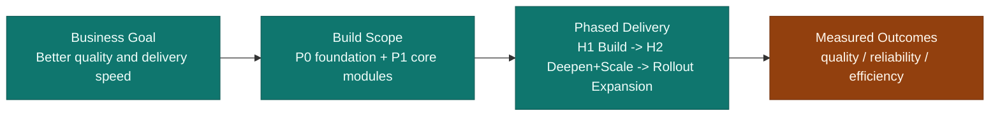
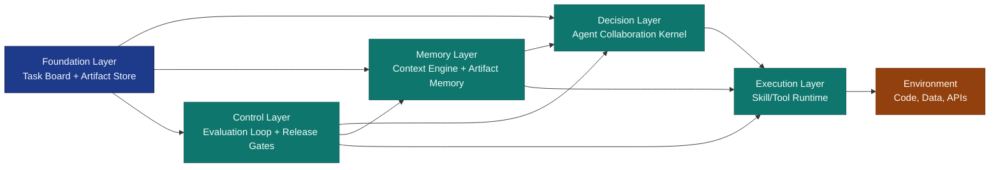
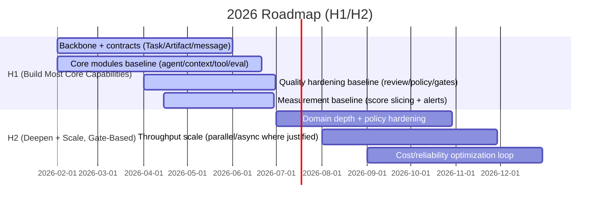
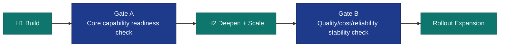
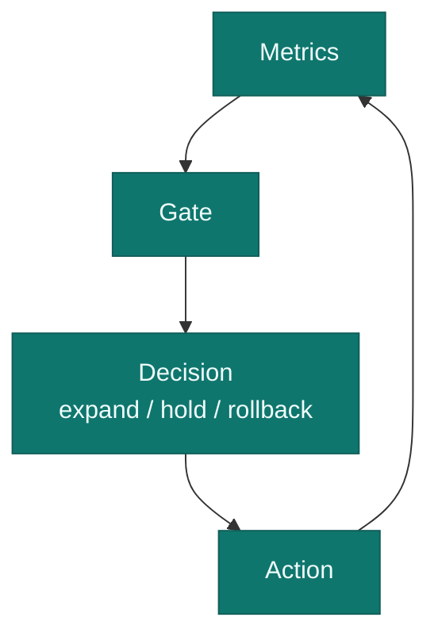

# Agent System Plan: Direction, Architecture, and Roadmap

## 0) At a Glance

- H1 target: build most core capabilities to a usable baseline.
- H2 target: deepen quality/reliability and scale with gates.
- Build order is explicit: define core modules first, then justify with external evidence.
- Scale-up is metric-gated, so quality and cost stay under control.

## 1) What We Build First

### 1.1 P0 and P1 Scope

| Priority | Module | Why It Is in This Tier |
| --- | --- | --- |
| P0 | Shared backbone (`Task Board + Artifact Store`) | Provides traceable state and evidence for all other modules |
| P1 | Agent collaboration kernel (`Planner -> Operator`, optional Reviewer) | Core decision and execution loop |
| P1 | Context engine | Keeps responses grounded and budgeted |
| P1 | Skill/Tool runtime (MCP-first, typed contracts) | Reliable external actions with governance |
| P1 | Evaluation loop (trace -> scorecard -> gate) | Continuous quality and risk control |

### 1.2 Architecture Overview

| Capability | Module Set | Business Value |
| --- | --- | --- |
| Decision quality | Agent collaboration kernel | Fewer failed attempts, clearer ownership |
| Execution quality | Skill/Tool runtime | Faster and safer execution |
| Continuity | Context + artifact memory | Less rework, better consistency |
| Control | Evaluation loop + gates | Earlier risk detection |
| Accountability | Shared backbone | Full traceability |

`Artifact Store` is the evidence repository for step outputs (for example: `prd.md`, `tool_output.json`, `review_checklist.json`, `diff.patch`).  
It is not the scheduler (`Task Board` does scheduling). It stores immutable artifacts with stable links such as `artifact://tasks/T-104/steps/S3/prd.md`, so review, replay, and audit are straightforward.

## 2) Why This Build Order

### 2.1 Industry Signals and Our Choices

| Industry Direction (2024-2026) | Our Choice | Why It Matters |
| --- | --- | --- |
| Start with simple, disciplined agent collaboration | Small-core model (`Planner -> Operator`, optional Reviewer) | Lower coordination noise and lower failure surface |
| Context quality matters more than context size | Context engine is core, not optional | Controls drift/hallucination and token waste |
| Tool/runtime quality drives outcomes | MCP-first typed tool layer with governance | Better reproducibility and safer execution |
| Evaluation setup can change headline results | Evaluation loop from day one | Avoids false positives and late surprises |
| Evidence-first systems scale better | Shared backbone as foundation | Enables traceability and controlled iteration |

### 2.2 External Data We Track (What the Numbers Mean)

How to read this section:
- Different rows use different benchmarks, so percentages are not directly comparable across rows.
- Use each row as: `metric definition -> baseline/comparison -> architecture implication`.

| Evidence | Metric (what is measured) | Baseline / Comparison | What the number says | Decision Impact | Source |
| --- | --- | --- | --- | --- | --- |
| ReAct | Task success rate on ALFWorld/WebShop | Compared with prior methods in the paper | ReAct reports absolute gains of `+34%` (ALFWorld) and `+10%` (WebShop) | Keep a structured decision-execution loop (`Planner -> Operator`) as core | https://arxiv.org/abs/2210.03629 |
| SWE-bench progression | Issue-resolution rate on SWE-bench | Early baseline vs SWE-agent result on the same benchmark family | `1.96% -> 12.47%` shows architecture/scaffolding can materially change outcomes | Treat agent architecture as a primary lever, not a UI detail | https://www.swebench.com/original.html |
| Agentless | Issue-resolution rate on SWE-bench Lite (plus cost) | Agentless result on Lite benchmark | `32.00%` at low cost shows simpler control designs can outperform heavier stacks in some settings | Avoid complexity-by-default; add modules only when data justifies | https://arxiv.org/abs/2407.01489 |
| OpenAI SWE-bench Verified report | Issue-resolution rate under different benchmark setups/scaffolds | Verified vs original benchmark; scaffold A vs scaffold B | `33.2% vs 16%` and `2.7% to 28.3%` range show evaluation setup can change headline results a lot | Build evaluation as a day-1 capability, not a late-stage add-on | https://openai.com/index/introducing-swe-bench-verified/ |
| GPT-4.1 report | Issue-resolution rate on SWE-bench Verified | GPT-4.1 reported result on Verified | `54.6%` plus explicit sensitivity to prompts/tools highlights runtime design importance | Invest early in tool/runtime quality and prompt contracts | https://openai.com/index/gpt-4-1/ |
| Sequential-NIAH (EMNLP 2025) | Retrieval/needle-finding accuracy under long sequential context | Best reported model in that test setup | Even the best model has limited max accuracy (`63.50%`) in this long-context setting | Keep context engineering as a core module; larger windows alone are not enough | https://aclanthology.org/2025.emnlp-main.1497/ |

## 3) Roadmap (H1 Build, H2 Deepen and Scale)

| Phase | Goal | Exit Evidence |
| --- | --- | --- |
| H1 | Build most core capabilities into a stable baseline | backbone live, core modules running, gates and scorecards operational |
| H2 | Deepen quality and scale with control | broader domain coverage, higher throughput, stable quality and bounded cost |

### 3.1 What "Scale" Means in This Plan

In this document, `scale` does not mean "add complexity everywhere". It means controlled growth on four dimensions:

| Scale Dimension | Meaning | Non-Goal |
| --- | --- | --- |
| Throughput scale | More tasks completed per time unit | blindly adding more agents |
| Coverage scale | More scenarios/domains handled with the same operating model | uncontrolled custom flows per team |
| Reliability scale | Stable quality while volume grows | accepting higher failure rates for speed |
| Cost scale | Better unit economics (`cost per completed task`) | increasing spend without outcome lift |

### 3.2 How We Decide to Move Between Phases

The roadmap answers **when** we plan to move.  
The gate model answers **whether** we are ready to move.

## 4) Gate Design (Why This Section Exists)

This section exists because schedule alone is not a safety mechanism.  
The gates make phase transition evidence-based and reversible.

| Metric | Why This Metric | Decision It Supports | Example Trigger |
| --- | --- | --- | --- |
| Acceptance success rate | Direct quality outcome signal | Can we move from `H1 Build` to `H2 Deepen+Scale`? | sustained drop vs baseline |
| Repair-loop rate | Captures process instability | Is current loop reliable enough for broader rollout? | persistent increase over baseline |
| Tool error rate | Captures runtime fragility | Is tool layer mature for wider usage? | recurring spikes or unstable recovery |
| Cost per completed task | Unit economics signal | Is scale financially reasonable? | budget drift trend |
| Regression catch-before-release rate | Control effectiveness signal | Are gates preventing bad releases before expansion? | decline in pre-release detection |
| Context failure rate (truncation/drift) | Context quality health signal | Is context policy adequate? | sustained increase in context-related failures |
| Standard pipeline adoption rate | Operating model maturity signal | Is the plan being used consistently? | low or stalled adoption |

## 5) Monthly Scorecard

| Metric Group | KPI | Why It Matters |
| --- | --- | --- |
| Outcome | acceptance success rate | direct quality signal |
| Reliability | repair-loop rate, tool error rate | stability signal |
| Efficiency | latency p95, cost per completed task | productivity and cost discipline |
| Control | regressions caught before release | governance effectiveness |
| Adoption | % tasks using standard pipeline | operating model maturity |

## 6) Bottom Line

- The build scope is clear.
- The build order is evidence-backed.
- Progress is measurable at each phase.
- Scale depends on passing quality/cost/reliability gates.

## 7) References

| Source | Link |
| --- | --- |
| ReAct (ICLR 2023) | https://arxiv.org/abs/2210.03629 |
| SWE-bench baseline/progression | https://www.swebench.com/original.html |
| SWE-bench project updates | https://www.swebench.com/ |
| Agentless | https://arxiv.org/abs/2407.01489 |
| OpenAI SWE-bench Verified | https://openai.com/index/introducing-swe-bench-verified/ |
| OpenAI GPT-4.1 | https://openai.com/index/gpt-4-1/ |
| Anthropic: building effective agents | https://www.anthropic.com/engineering/building-effective-agents |
| Sequential-NIAH (EMNLP 2025) | https://aclanthology.org/2025.emnlp-main.1497/ |
