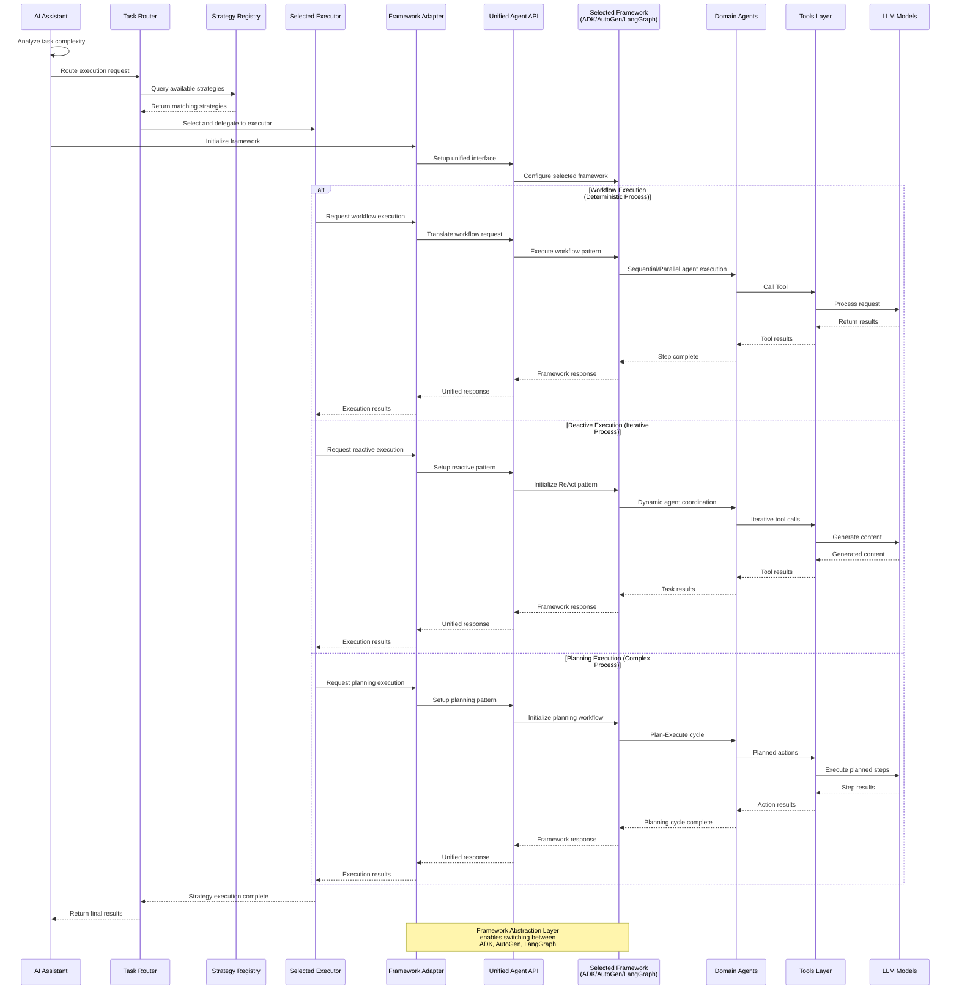

# Multi-Agent System Architecture with Framework Abstraction

## System Overview

Multi-Framework Agent System with Flexible Execution Engine - Backend Architecture Design with Framework Abstraction Layer

This architecture supports multiple agent frameworks (ADK, AutoGen, LangGraph) through a unified abstraction layer, enabling framework switching without application logic changes. The system features a flexible execution engine that supports multiple execution patterns (workflow, reactive, planning) through a strategy-based approach, allowing for both deterministic and adaptive task processing.

## Core Architecture

### 1. Backend System Architecture

```mermaid
graph TB
    subgraph "Application Execution Layer"
        ENTRY[AI Assistant]:::selfBuilt
        
        subgraph "Execution Engine"
            ROUTER[Task Router]:::selfBuilt
            REGISTRY[Strategy Registry]:::selfBuilt
            
            subgraph "Execution Strategies"
                WORKFLOW_EXEC[Workflow Executor]:::selfBuilt
                REACTIVE_EXEC[Reactive Executor]:::selfBuilt
                PLANNING_EXEC[Planning Executor]:::selfBuilt
                CUSTOM_EXEC[Custom Executors...]:::selfBuilt
            end
        end
        
        SM[Session Manager]:::selfBuilt
    end
    
    subgraph "Framework Abstraction Layer"
        FAL[Framework Adapter]:::selfBuilt
        API[Unified Agent API]:::selfBuilt
        CONFIG[Framework Config]:::selfBuilt
    end
    
    subgraph "Multi-Framework Support"
        subgraph "ADK Backend"
            ADK_RT[ADK Runtime]:::thirdParty
            ADK_AG[ADK Agents]:::thirdParty
        end
        subgraph "AutoGen Backend"  
            AG_RT[AutoGen Runtime]:::thirdParty
            AG_CONV[Conversation Manager]:::thirdParty
        end
        subgraph "LangGraph Backend"
            LG_RT[LangGraph Runtime]:::thirdParty
            LG_FLOW[Graph Executor]:::thirdParty
        end
    end
    
    subgraph "Core Agent Layer"
        DA1[Domain Agent 1]:::selfBuilt
        DA2[Domain Agent 2]:::selfBuilt 
        DA3[Domain Agent 3]:::selfBuilt
        DA4[Domain Agent 4]:::selfBuilt
    end
    
    subgraph "Tool Service Layer"
        T1[Tool 1]:::selfBuilt
        T2[Tool 2]:::selfBuilt
        T3[Tool 3]:::selfBuilt
        T4[Tool 4]:::selfBuilt
    end
    
    subgraph "Infrastructure Layer"
        SS[State Store]:::selfBuilt
        AR[Agent Registry]:::selfBuilt
        TR[Tool Registry]:::selfBuilt
        LG[Logging System]:::selfBuilt
        MON[Monitoring]:::selfBuilt
    end
    
    subgraph "External Services"
        LLM[LLM Models<br/>Multi-Provider Support]:::thirdParty
        SE[Search Engines]:::thirdParty
        DB[(Database)]:::thirdParty
        STORAGE[(Storage System)]:::thirdParty
    end
    
    classDef thirdParty fill:#f9f9f9,stroke:#999,stroke-width:2,stroke-dasharray: 5 5
    classDef selfBuilt fill:#e1f5fe,stroke:#01579b,stroke-width:2
    
    %% Dependencies
    ENTRY --> ROUTER
    ROUTER --> REGISTRY
    ROUTER --> WORKFLOW_EXEC
    ROUTER --> REACTIVE_EXEC
    ROUTER --> PLANNING_EXEC
    ROUTER --> CUSTOM_EXEC
    ENTRY --> SM
    
    %% Framework Abstraction Layer connections
    WORKFLOW_EXEC --> FAL
    REACTIVE_EXEC --> FAL
    PLANNING_EXEC --> FAL
    CUSTOM_EXEC --> FAL
    FAL --> API
    API --> CONFIG
    
    %% Framework Selection (configurable)
    FAL -.-> ADK_RT
    FAL -.-> AG_RT  
    FAL -.-> LG_RT
    
    ADK_RT --> ADK_AG
    AG_RT --> AG_CONV
    LG_RT --> LG_FLOW
    
    %% Agent connections through abstraction
    API --> DA1
    API --> DA2
    API --> DA3
    API --> DA4
    
    DA1 --> T1
    DA2 --> T2
    DA3 --> T3
    DA4 --> T4
    
    T1 --> SE
    T2 --> LLM
    T3 --> LLM
    T4 --> LLM
    
    %% Infrastructure connections
    FAL --> SS
    API --> AR
    SM --> SS
    FAL --> LG
    FAL --> MON
    
    SS --> STORAGE
    LG --> DB
    MON --> DB
    
    classDef orchestrationLayer fill:#f3e5f5
    classDef agentLayer fill:#e8f5e8
    classDef toolLayer fill:#fff3e0
    classDef infraLayer fill:#fce4ec
    classDef externalLayer fill:#f1f8e9
    classDef entryPoint fill:#ffebee
    
    class ENTRY entryPoint
    class ROUTER,REGISTRY,WORKFLOW_EXEC,REACTIVE_EXEC,PLANNING_EXEC,CUSTOM_EXEC,SM executionLayer
    class DA1,DA2,DA3,DA4 agentLayer
    class T1,T2,T3,T4 toolLayer
    class RT,SS,LG,MON infraLayer
    class LLM,SE,DB,STORAGE externalLayer
```

### 2. Agent Collaboration Flow

## Core Components

### Framework Abstraction Layer

#### Framework Adapter
- **Role**: Unified interface for different agent frameworks (ADK, AutoGen, LangGraph)
- **Function**: Translates high-level orchestration commands to framework-specific operations
- **Configuration**: Runtime framework selection based on task requirements or configuration
- **Benefits**: Framework-agnostic development, easy migration between frameworks

#### Unified Agent API
- **Role**: Standardized agent interface across all supported frameworks
- **Function**: Provides consistent agent lifecycle management, state handling, and communication patterns
- **Abstraction**: Hides framework-specific implementation details from application layer
- **Extensibility**: Plugin architecture for adding new framework support

#### Framework Configuration
- **Role**: Dynamic framework selection and configuration management
- **Supported Frameworks**:
  - **ADK**: Enterprise-grade, Vertex AI integration, built-in monitoring
  - **AutoGen**: Multi-agent conversations, research scenarios
  - **LangGraph**: Graph-based workflows, maximum flexibility
- **Selection Criteria**: Task complexity, performance requirements, compliance needs
- **Runtime Switching**: Support for different frameworks within the same application instance

### Application Execution Layer

#### AI Assistant
- **Role**: Analyze incoming tasks and route to execution engine
- **Decision Logic**: Evaluate task characteristics to determine routing needs
- **Routing**: Direct tasks to Task Router for strategy selection
- **Dependencies**: Session Manager for context management

#### Execution Engine

The Execution Engine replaces the previous binary Workflow Engine + Coordinator Agent design with a flexible, strategy-based approach.

**Task Router**:
- **Role**: Analyze task characteristics and select appropriate execution strategy
- **Function**: Routes tasks to registered execution strategies based on task requirements
- **Extensibility**: Supports rule-based routing with future LLM-based enhancement capability
- **Integration**: Handles both internal strategy execution and external workflow engine delegation

**Strategy Registry**:
- **Role**: Manage available execution strategies and their capabilities
- **Function**: Dynamic strategy registration, capability matching, and priority management
- **Features**: 
  - Runtime strategy registration without system restart
  - Strategy capability querying and discovery
  - Priority-based strategy selection for overlapping capabilities
- **Extensibility**: Plugin architecture for adding new execution patterns

**Execution Strategies**:
- **Workflow Executor**: Handles deterministic, sequential/parallel processes using ADK's workflow agents
- **Reactive Executor**: Manages iterative, exploratory tasks using ReAct patterns
- **Planning Executor**: Processes complex multi-step tasks requiring upfront planning
- **Custom Executors**: Extensible framework for domain-specific execution patterns

**Key Design Principles**:
1. **Strategy Flexibility**: New execution patterns can be added without modifying core engine
2. **Framework Agnostic**: Works consistently across ADK, AutoGen, and LangGraph
3. **External Integration**: Supports integration with external workflow engines
4. **Backward Compatibility**: Existing workflow logic can migrate smoothly to new architecture

### Core Agent Layer

#### Domain Agents
- **Role**: Execute specific domain tasks as assigned by Coordinator
- **Flexible Design**: Agent capabilities defined dynamically based on business requirements
- **Tool Integration**: Each domain agent can access appropriate tools for their tasks
- **Model Selection**: TBD - Appropriate model selection based on task complexity

**Domain Agent Examples**:
- Domain Agent 1: Execute task using Tool 1
- Domain Agent 2: Execute task using Tool 2  
- Domain Agent 3: Execute task using Tool 3
- Domain Agent 4: Execute task using Tool 4

*Note: Specific domain responsibilities and tool definitions will be determined during implementation based on actual business needs*

### Infrastructure Layer

#### Framework Runtime (ADK Primary)
- **Role**: Agent lifecycle management, model invocation, error handling
- **Configuration**: Google Cloud project, Vertex AI integration for ADK; extensible for other frameworks
- **Features**: Session management, state synchronization, performance monitoring
- **Framework Support**: ADK as primary runtime, with abstraction layer for AutoGen/LangGraph integration

#### State Store
- **Role**: State persistence, data consistency guarantee
- **Implementation**: In-memory version (MVP) → ADK internal memory components → Distributed storage (if needed)
- **Pattern**: Session/User/Global three-layer state management
- **Note**: Initial implementation will be pure in-memory, migration path TBD based on requirements

## Technical Decisions

### 1. Communication Pattern
- **State Sharing**: Use ADK context.state for inter-agent data transfer
- **Async Execution**: Support parallel agent execution for performance
- **Strategy Registry**: Dynamic strategy registration and capability-based routing

### 2. Scaling Strategy
- **Horizontal Scaling**: Support multi-pod deployment with load balancing
- **Vertical Scaling**: Dynamic agent resource adjustment based on load
- **Modular Design**: Loose coupling design for independent component scaling
- **Strategy Isolation**: Each execution strategy can scale independently

### 3. Execution Strategy Design
- **Plugin Architecture**: New execution patterns can be added without core system changes
- **Priority-based Selection**: Multiple strategies can handle the same task type with defined priorities
- **External Integration**: Support for both internal execution and external workflow engine delegation
- **Framework Agnostic**: Consistent behavior across ADK, AutoGen, and LangGraph frameworks

## Security and Compliance

*Implementation details TBD - will be defined based on production requirements*

### Access Control
- TBD: Authentication and authorization mechanisms
- TBD: API security configurations
- TBD: Session management policies

### Data Protection
- TBD: Input validation and sanitization strategies
- TBD: Data privacy and protection measures
- TBD: Audit logging specifications

### Monitoring and Alerting
- TBD: Performance monitoring setup
- TBD: Error tracking and alerting systems
- TBD: System health monitoring

## Performance Targets

*Performance specifications TBD - will be defined based on testing and production requirements*

### MVP Phase
- TBD: Response time targets
- TBD: Concurrency requirements  
- TBD: Availability expectations
- TBD: Success rate thresholds

### Production Environment
- TBD: Production response time goals
- TBD: Production concurrency capacity
- TBD: Production availability targets
- TBD: Production success rate requirements

---