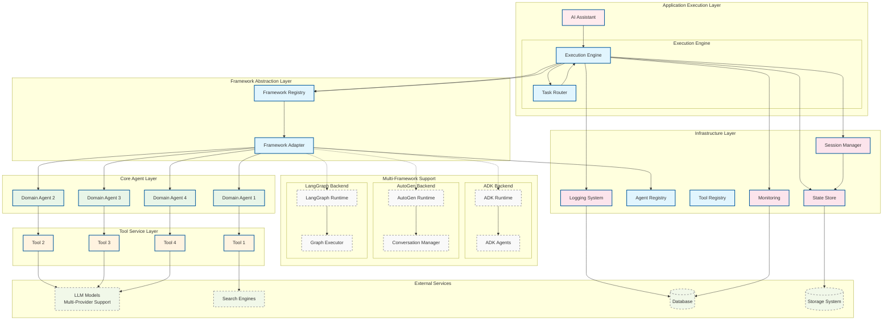
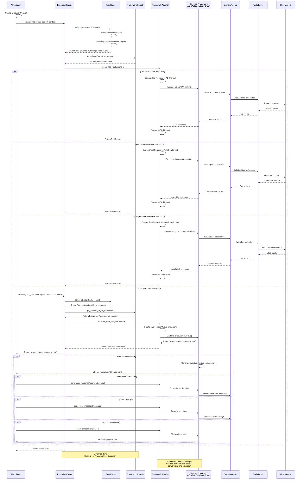

# Multi-Agent System Architecture with Framework Abstraction

## System Overview

Multi-Framework Agent System with Flexible Execution Engine - Backend Architecture Design with Framework Abstraction Layer

This architecture supports multiple agent frameworks (ADK, AutoGen, LangGraph) through a unified abstraction layer, enabling framework switching without application logic changes. The system features a flexible execution engine that supports multiple execution patterns (workflow, reactive, planning) through a strategy-based approach, allowing for both deterministic and adaptive task processing.

## Core Architecture

### 1. Backend System Architecture

### 2. Agent Collaboration Flow

## Core Components

### Framework Abstraction Layer

#### Framework Adapter
- **Role**: Unified interface for different agent frameworks (ADK, AutoGen, LangGraph)
- **Function**: Translates high-level orchestration commands to framework-specific operations
- **Live Execution**: Supports real-time bidirectional communication through `execute_task_live()` method
- **Streaming Capabilities**: Enables interactive workflows with tool approval, user input, and real-time cancellation
- **Configuration**: Runtime framework selection based on task requirements or configuration
- **Benefits**: Framework-agnostic development, easy migration between frameworks

#### Framework Registry
- **Role**: Central registry for framework adapter management
- **Function**: Manages framework adapter instances, provides factory methods, handles lifecycle
- **Configuration**: Dynamic framework registration and adapter creation
- **Benefits**: Centralized framework management, easy framework discovery and switching

### Application Execution Layer

#### AI Assistant
- **Role**: Analyze incoming tasks and route to execution engine
- **Decision Logic**: Evaluate task characteristics to determine routing needs  
- **Routing**: Direct tasks to Execution Engine for processing
- **Dependencies**: Access to Infrastructure Layer services for context management

#### Execution Engine

The Execution Engine provides a simplified, direct approach to framework-based task execution.

**Core Responsibilities**:
- **Strategy Selection**: Uses TaskRouter to analyze and select appropriate execution strategy
- **Framework Routing**: Directly maps strategy to framework adapter via FrameworkRegistry
- **Task Execution**: Delegates execution to selected framework adapter (sync and live modes)
- **Live Session Management**: Coordinates real-time interactive execution sessions
- **Result Management**: Returns unified TaskResult or LiveExecutionResult regardless of underlying framework

**Task Router**:
- **Role**: Analyze task characteristics and select appropriate execution strategy
- **Function**: Routes tasks based on task requirements and complexity analysis
- **Strategy Management**: Maintains and matches against available strategy configurations
- **Decision Logic**: Rule-based strategy selection with priority-based conflict resolution

**Key Design Principles**:
1. **Direct Framework Mapping**: Strategy configurations directly specify target frameworks
2. **Simplified Flow**: Eliminates intermediate execution layers for better performance
3. **Framework Agnostic**: Consistent behavior regardless of underlying framework
4. **Configuration Driven**: Strategy-framework mapping managed through configuration

### Core Agent Layer

#### Domain Agents
- **Role**: Execute specific domain tasks as assigned by Coordinator
- **Flexible Design**: Agent capabilities defined dynamically based on business requirements
- **Tool Integration**: Each domain agent can access appropriate tools for their tasks
- **Model Selection**: TBD - Appropriate model selection based on task complexity

**Domain Agent Examples**:
- Domain Agent 1: Execute task using Tool 1
- Domain Agent 2: Execute task using Tool 2  
- Domain Agent 3: Execute task using Tool 3
- Domain Agent 4: Execute task using Tool 4

*Note: Specific domain responsibilities and tool definitions will be determined during implementation based on actual business needs*

### Infrastructure Layer

#### Session Manager
- **Role**: Session lifecycle management and state persistence
- **Function**: Manages SessionContext across user interactions and framework boundaries
- **Features**: Session creation, state synchronization, TTL management, cleanup
- **Integration**: Used by Framework Abstraction Layer for consistent session handling

#### Framework Runtime (ADK Primary)
- **Role**: Agent lifecycle management, model invocation, error handling
- **Configuration**: Google Cloud project, Vertex AI integration for ADK; extensible for other frameworks  
- **Features**: Performance monitoring, framework-specific optimizations
- **Framework Support**: ADK as primary runtime, with abstraction layer for AutoGen/LangGraph integration

#### State Store
- **Role**: State persistence, data consistency guarantee
- **Implementation**: In-memory version (MVP) → ADK internal memory components → Distributed storage (if needed)
- **Pattern**: Session/User/Global three-layer state management
- **Note**: Initial implementation will be pure in-memory, migration path TBD based on requirements

## Technical Decisions

### 1. Communication Pattern
- **State Sharing**: Use ADK context.state for inter-agent data transfer
- **Async Execution**: Support parallel agent execution for performance
- **Framework Registry**: Centralized framework adapter management and discovery

### 2. Scaling Strategy
- **Horizontal Scaling**: Support multi-pod deployment with load balancing
- **Vertical Scaling**: Dynamic agent resource adjustment based on load
- **Modular Design**: Loose coupling design for independent component scaling
- **Framework Isolation**: Each framework adapter can scale independently

### 3. Execution Strategy Design
- **Configuration Driven**: Strategy-framework mapping through configuration files
- **Direct Framework Routing**: Strategies directly specify target frameworks
- **Simplified Architecture**: Eliminates unnecessary intermediate layers
- **Framework Agnostic**: Consistent behavior across ADK, AutoGen, and LangGraph frameworks

### 4. Live Execution and Streaming Strategy
- **Bidirectional Communication**: Real-time event streaming with user interaction support
- **Framework Integration**: Live execution capabilities exposed through framework adapters
- **Event Conversion**: ADK events converted to unified TaskStreamChunk format
- **Interactive Workflows**: Built-in support for tool approval and user intervention scenarios
- **Session Management**: Proper lifecycle handling for long-running interactive sessions

## Security and Compliance

*Implementation details TBD - will be defined based on production requirements*

### Access Control
- TBD: Authentication and authorization mechanisms
- TBD: API security configurations
- TBD: Session management policies

### Data Protection
- TBD: Input validation and sanitization strategies
- TBD: Data privacy and protection measures
- TBD: Audit logging specifications

### Monitoring and Alerting
- TBD: Performance monitoring setup
- TBD: Error tracking and alerting systems
- TBD: System health monitoring

## Performance Targets

*Performance specifications TBD - will be defined based on testing and production requirements*

### MVP Phase
- TBD: Response time targets
- TBD: Concurrency requirements  
- TBD: Availability expectations
- TBD: Success rate thresholds

### Production Environment
- TBD: Production response time goals
- TBD: Production concurrency capacity
- TBD: Production availability targets
- TBD: Production success rate requirements

---