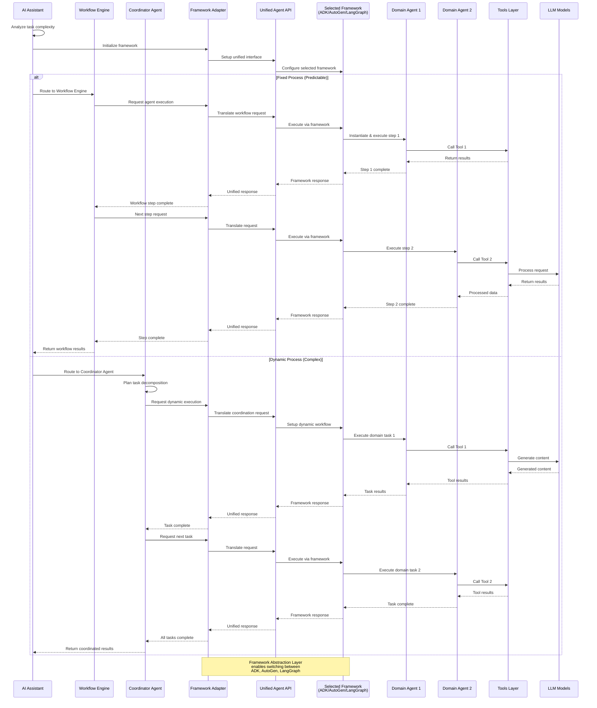

# Multi-Agent System Architecture with Framework Abstraction

## System Overview

Multi-Framework Agent System for User Story Generation - Backend Architecture Design with Framework Abstraction Layer

This architecture supports multiple agent frameworks (ADK, AutoGen, LangGraph) through a unified abstraction layer, enabling framework switching without application logic changes.

## Core Architecture

### 1. Backend System Architecture

```mermaid
graph TB
    subgraph "Application Orchestration Layer"
        ENTRY[AI Assistant]:::selfBuilt
        WF[Workflow Engine]:::selfBuilt
        COORD[Coordinator Agent]:::selfBuilt
        SM[Session Manager]:::selfBuilt
    end
    
    subgraph "Framework Abstraction Layer"
        FAL[Framework Adapter]:::selfBuilt
        API[Unified Agent API]:::selfBuilt
        CONFIG[Framework Config]:::selfBuilt
    end
    
    subgraph "Multi-Framework Support"
        subgraph "ADK Backend"
            ADK_RT[ADK Runtime]:::thirdParty
            ADK_AG[ADK Agents]:::thirdParty
        end
        subgraph "AutoGen Backend"  
            AG_RT[AutoGen Runtime]:::thirdParty
            AG_CONV[Conversation Manager]:::thirdParty
        end
        subgraph "LangGraph Backend"
            LG_RT[LangGraph Runtime]:::thirdParty
            LG_FLOW[Graph Executor]:::thirdParty
        end
    end
    
    subgraph "Core Agent Layer"
        DA1[Domain Agent 1]:::selfBuilt
        DA2[Domain Agent 2]:::selfBuilt 
        DA3[Domain Agent 3]:::selfBuilt
        DA4[Domain Agent 4]:::selfBuilt
    end
    
    subgraph "Tool Service Layer"
        T1[Tool 1]:::selfBuilt
        T2[Tool 2]:::selfBuilt
        T3[Tool 3]:::selfBuilt
        T4[Tool 4]:::selfBuilt
    end
    
    subgraph "Infrastructure Layer"
        SS[State Store]:::selfBuilt
        AR[Agent Registry]:::selfBuilt
        TR[Tool Registry]:::selfBuilt
        LG[Logging System]:::selfBuilt
        MON[Monitoring]:::selfBuilt
    end
    
    subgraph "External Services"
        LLM[LLM Models<br/>Multi-Provider Support]:::thirdParty
        SE[Search Engines]:::thirdParty
        DB[(Database)]:::thirdParty
        STORAGE[(Storage System)]:::thirdParty
    end
    
    classDef thirdParty fill:#f9f9f9,stroke:#999,stroke-width:2,stroke-dasharray: 5 5
    classDef selfBuilt fill:#e1f5fe,stroke:#01579b,stroke-width:2
    
    %% Dependencies
    ENTRY --> WF
    ENTRY --> COORD
    ENTRY --> SM
    
    %% Framework Abstraction Layer connections
    WF --> FAL
    COORD --> FAL
    FAL --> API
    API --> CONFIG
    
    %% Framework Selection (configurable)
    FAL -.-> ADK_RT
    FAL -.-> AG_RT  
    FAL -.-> LG_RT
    
    ADK_RT --> ADK_AG
    AG_RT --> AG_CONV
    LG_RT --> LG_FLOW
    
    %% Agent connections through abstraction
    API --> DA1
    API --> DA2
    API --> DA3
    API --> DA4
    
    DA1 --> T1
    DA2 --> T2
    DA3 --> T3
    DA4 --> T4
    
    T1 --> SE
    T2 --> LLM
    T3 --> LLM
    T4 --> LLM
    
    %% Infrastructure connections
    FAL --> SS
    API --> AR
    SM --> SS
    FAL --> LG
    FAL --> MON
    
    SS --> STORAGE
    LG --> DB
    MON --> DB
    
    classDef orchestrationLayer fill:#f3e5f5
    classDef agentLayer fill:#e8f5e8
    classDef toolLayer fill:#fff3e0
    classDef infraLayer fill:#fce4ec
    classDef externalLayer fill:#f1f8e9
    classDef entryPoint fill:#ffebee
    
    class ENTRY entryPoint
    class WF,COORD,SM orchestrationLayer
    class DA1,DA2,DA3,DA4 agentLayer
    class T1,T2,T3,T4 toolLayer
    class RT,SS,LG,MON infraLayer
    class LLM,SE,DB,STORAGE externalLayer
```

### 2. Agent Collaboration Flow

## Core Components

### Framework Abstraction Layer

#### Framework Adapter
- **Role**: Unified interface for different agent frameworks (ADK, AutoGen, LangGraph)
- **Function**: Translates high-level orchestration commands to framework-specific operations
- **Configuration**: Runtime framework selection based on task requirements or configuration
- **Benefits**: Framework-agnostic development, easy migration between frameworks

#### Unified Agent API
- **Role**: Standardized agent interface across all supported frameworks
- **Function**: Provides consistent agent lifecycle management, state handling, and communication patterns
- **Abstraction**: Hides framework-specific implementation details from application layer
- **Extensibility**: Plugin architecture for adding new framework support

#### Framework Configuration
- **Role**: Dynamic framework selection and configuration management
- **Supported Frameworks**:
  - **ADK**: Enterprise-grade, Vertex AI integration, built-in monitoring
  - **AutoGen**: Multi-agent conversations, research scenarios
  - **LangGraph**: Graph-based workflows, maximum flexibility
- **Selection Criteria**: Task complexity, performance requirements, compliance needs
- **Runtime Switching**: Support for different frameworks within the same application instance

### Application Orchestration Layer

#### AI Assistant
- **Role**: Analyze incoming tasks and route to appropriate orchestration pattern
- **Decision Logic**: Evaluate task complexity and predictability to choose execution mode
- **Routing**: Direct tasks to either Workflow Engine or Coordinator Agent
- **Dependencies**: Session Manager for context management

**Two Orchestration Patterns in ADK**:

#### Workflow Engine (Fixed Orchestration)
- **Role**: Pre-defined workflow execution with fixed steps and sequences
- **Pattern**: Sequential → Parallel → Conditional workflows
- **Use Case**: Well-defined processes with predictable execution paths
- **Dependencies**: ADK Runtime, Domain Agents
- **Advantages**: Fast execution, predictable resource usage, easy debugging

#### Coordinator Agent (Dynamic Planning)
- **Role**: Dynamic task decomposition and adaptive agent coordination
- **Pattern**: Intelligent planning based on context and requirements
- **Use Case**: Complex scenarios requiring adaptive decision-making
- **Dependencies**: ADK Runtime, Domain Agents
- **Model**: TBD - Determined during implementation
- **Communication**: context.state sharing
- **Advantages**: Flexible handling, adaptive to changing requirements

*Note: AI Assistant determines routing strategy - choose workflow for predictable processes, coordinator for complex adaptive tasks*

### Core Agent Layer

#### Domain Agents
- **Role**: Execute specific domain tasks as assigned by Coordinator
- **Flexible Design**: Agent capabilities defined dynamically based on business requirements
- **Tool Integration**: Each domain agent can access appropriate tools for their tasks
- **Model Selection**: TBD - Appropriate model selection based on task complexity

**Domain Agent Examples**:
- Domain Agent 1: Execute task using Tool 1
- Domain Agent 2: Execute task using Tool 2  
- Domain Agent 3: Execute task using Tool 3
- Domain Agent 4: Execute task using Tool 4

*Note: Specific domain responsibilities and tool definitions will be determined during implementation based on actual business needs*

### Infrastructure Layer

#### ADK Runtime
- **Role**: Agent lifecycle management, model invocation, error handling
- **Configuration**: Google Cloud project, Vertex AI integration
- **Features**: Session management, state synchronization, performance monitoring

#### State Store
- **Role**: State persistence, data consistency guarantee
- **Implementation**: In-memory version (MVP) → ADK internal memory components → Distributed storage (if needed)
- **Pattern**: Session/User/Global three-layer state management
- **Note**: Initial implementation will be pure in-memory, migration path TBD based on requirements

## Technical Decisions

### 1. Communication Pattern
- **State Sharing**: Use ADK context.state for inter-agent data transfer
- **Async Execution**: Support parallel agent execution for performance

### 2. Scaling Strategy
- **Horizontal Scaling**: Support multi-pod deployment with load balancing
- **Vertical Scaling**: Dynamic agent resource adjustment based on load
- **Modular Design**: Loose coupling design for independent component scaling

## Security and Compliance

*Implementation details TBD - will be defined based on production requirements*

### Access Control
- TBD: Authentication and authorization mechanisms
- TBD: API security configurations
- TBD: Session management policies

### Data Protection
- TBD: Input validation and sanitization strategies
- TBD: Data privacy and protection measures
- TBD: Audit logging specifications

### Monitoring and Alerting
- TBD: Performance monitoring setup
- TBD: Error tracking and alerting systems
- TBD: System health monitoring

## Performance Targets

*Performance specifications TBD - will be defined based on testing and production requirements*

### MVP Phase
- TBD: Response time targets
- TBD: Concurrency requirements  
- TBD: Availability expectations
- TBD: Success rate thresholds

### Production Environment
- TBD: Production response time goals
- TBD: Production concurrency capacity
- TBD: Production availability targets
- TBD: Production success rate requirements

---