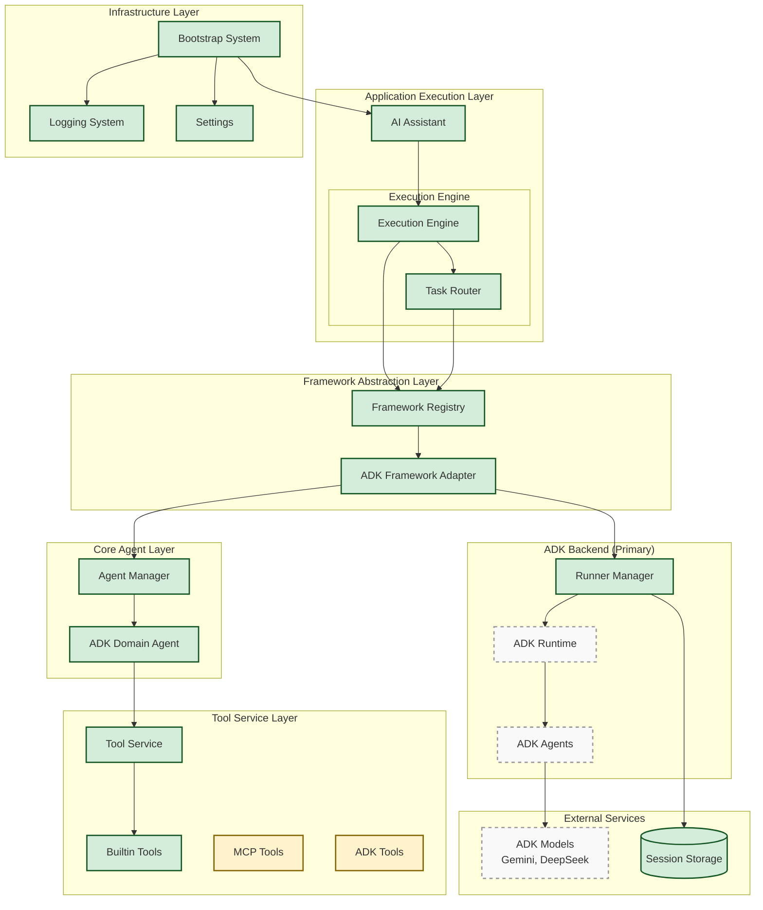
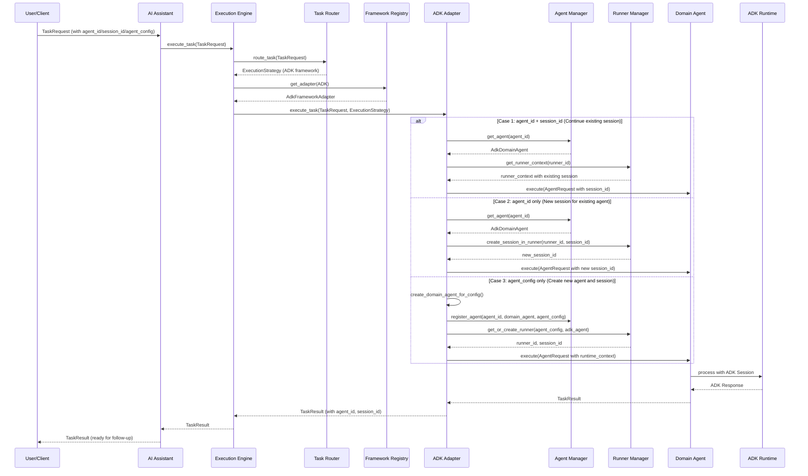
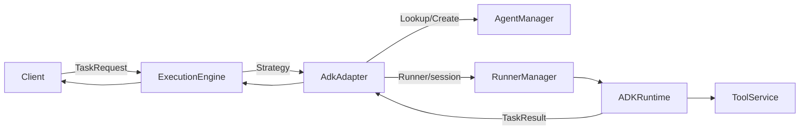
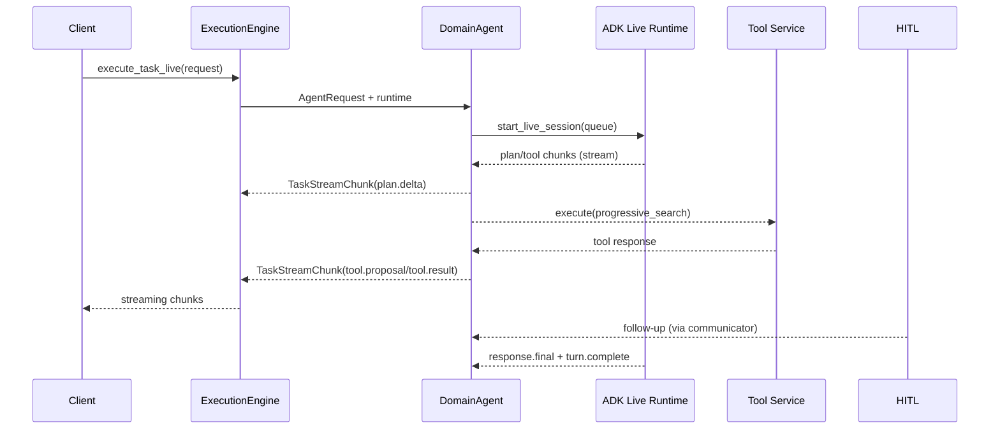
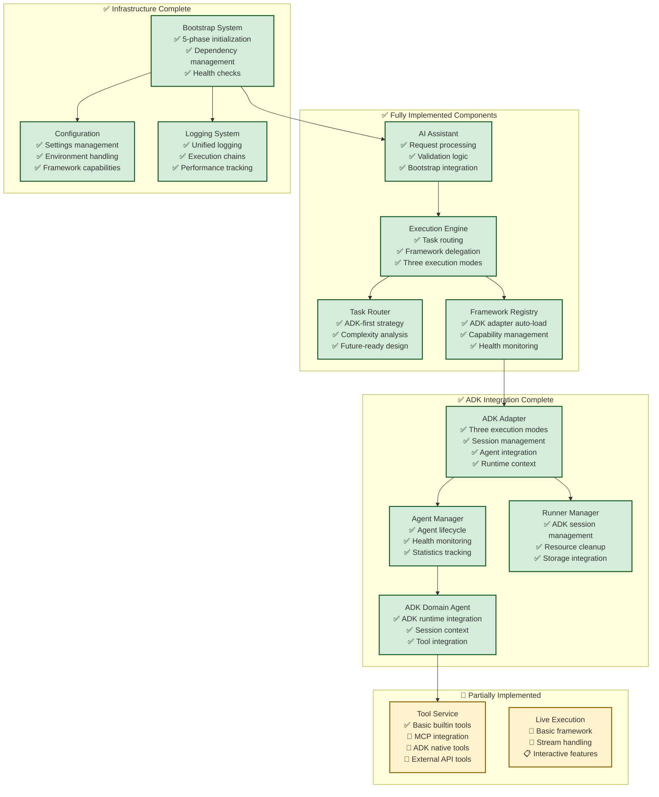

# Multi-Agent System Architecture with Framework Abstraction

## System Overview

Multi-Framework Agent System with ADK Primary Implementation - Backend Architecture Design with Framework Abstraction Layer

This architecture supports multiple agent frameworks (ADK, AutoGen, LangGraph) through a unified abstraction layer, enabling framework switching without application logic changes. **Current implementation focuses on ADK as the primary framework**, featuring a flexible execution engine that supports agent lifecycle management, session persistence, and multi-turn conversations. For ADK we adopt a **controlled reuse** model: agents/runners built for a given configuration can be reused across requests, business clients keep the same `chat_session_id` to maintain context, and cleanup hooks are available to reclaim runners/agents when sessions go idle or switch.

**Implementation Status:**
- ✅ **Phase 1 Complete**: ADK integration with full agent lifecycle and session management
- 🚧 **Phase 2 Partial**: Tool service and live execution capabilities  
- 📋 **Phase 3 Future**: Multi-framework support (AutoGen, LangGraph)

## Core Architecture

### 1. Backend System Architecture (Current Implementation)



### 2. Agent Execution Flow (Current Implementation)



### Detailed Execution Flows (Sync & Live)

#### Sync Execution Overview
- **Request Path**: `TaskRequest → ExecutionEngine → AdkFrameworkAdapter → AdkDomainAgent`
- **Runner Coordination**: RunnerManager either reuses an existing runner/session or provisions a new one based on `agent_id`/`agent_config`.
- **Tool Use**: Domain agent resolves the relevant tool set on-demand via `ToolService` and executes synchronously inside the ADK runtime.
- **Result Packaging**: ADK response is flattened into a single `TaskResult` (no incremental streaming) and returned to the caller.



#### Live Execution + Tool Use
- **Streaming Lifecycle**: `execute_task_live` yields an async generator of `TaskStreamChunk`s while a paired communicator sends user or approval messages back through the ADK `LiveRequestQueue`.
- **Chunk Taxonomy**:  
  `plan.delta / plan.summary → tool.proposal → tool.result → response.delta → turn.complete`
- **Tool Invocation Flow**: Tool proposals are emitted prior to tool execution. When upstream frameworks omit proposals, the domain agent synthesizes a `tool_proposal` chunk before producing the real `tool_result`.
- **HITL Bridge**: After the first turn completes, the suite prompts the operator (stdin) to decide whether to inject another user turn; responses are forwarded through `communicator.send_user_message`.



## Core Components (Current Implementation)

### Framework Abstraction Layer

#### ADK Framework Adapter (✅ Implemented)
- **Role**: Primary framework adapter implementing unified interface for ADK
- **Function**: Handles three execution modes (agent_id+session_id, agent_id only, agent_config only)
- **Session Management**: Integrates with RunnerManager for ADK session lifecycle
- **Agent Integration**: Coordinates with AgentManager for agent lifecycle
- **Benefits**: Full ADK integration with session persistence and multi-turn conversations

#### Framework Registry (✅ Implemented)  
- **Role**: Central registry for framework adapter management
- **Function**: Auto-loads ADK adapter, provides adapter discovery and lifecycle
- **Current Focus**: ADK-primary with extensible design for future frameworks
- **Benefits**: Centralized framework management with capability-driven configuration

### Application Execution Layer

#### AI Assistant (✅ Implemented)
- **Role**: Main system entry point for task processing
- **Function**: Request validation, bootstrap integration, result formatting
- **Live Support**: Basic live session support (under development)
- **Integration**: Direct bootstrap integration for easy initialization

#### Execution Engine (✅ Implemented)
- **Role**: Task orchestration and framework routing coordinator  
- **Function**: Routes all tasks to ADK via TaskRouter, handles three execution modes
- **Session Support**: Full support for agent_id + session_id architecture
- **Error Handling**: Comprehensive error handling with proper session context

#### Task Router (✅ Implemented)
- **Role**: Framework selection and execution strategy determination
- **Current Logic**: ADK-first routing with complexity analysis
- **Future Ready**: Extensible design for multi-framework routing
- **Strategy**: Returns ExecutionStrategy optimized for ADK execution

### Core Agent Layer

#### Agent Manager (✅ Implemented)
- **Role**: Agent lifecycle management and registry
- **Function**: Create, store, track, and cleanup agent instances  
- **Integration**: Works with AdkFrameworkAdapter for agent registration
- **Health Monitoring**: Agent health checks and statistics tracking

#### ADK Domain Agent (✅ Implemented)
- **Role**: Framework-specific agent implementation for ADK
- **Function**: Direct ADK integration with runtime context handling
- **Session Context**: Processes AgentRequest with session_id propagation
- **Tool Integration**: Integrates with ToolService for tool execution

#### Runner Manager (✅ Implemented)
- **Role**: ADK-specific session and runner lifecycle management
- **Function**: Create, manage, and cleanup ADK runners and sessions
- **Session Storage**: Handles persistent ADK session state
- **Resource Management**: Proper cleanup and resource tracking

### Tool Service Layer (🚧 Partial Implementation)

#### Tool Service (✅ Basic Implementation)
- **Role**: Unified tool execution interface
- **Current Support**: Builtin tools (echo, timestamp, chat_log)
- **Planned Support**: MCP tools, ADK native tools, external API tools
- **Integration**: Ready for agent tool execution

#### Streaming & HITL Design (✅ Instrumented)
- **TaskStreamChunk Envelope**  
  - `chunk_type`: semantic category (`PLAN_DELTA`, `TOOL_PROPOSAL`, …)  
  - `chunk_kind`: fine-grained identifier (`plan.delta`, `tool.result`, …)  
  - `metadata`: `stage`, `author`, `interaction_id`, tool descriptors, and ADK event hints  
  - `interaction_id`: stable key linking proposals to results (generated when upstream signals are absent)
- **Chunk Kinds in Live Sessions**

  | `chunk_kind`        | Description                                  | Primary Source                     |
  |---------------------|----------------------------------------------|------------------------------------|
  | `plan.delta` / `plan.summary` | Incremental reasoning plan            | ADK event metadata or fallback text detector |
  | `tool.proposal`     | Tool invocation intent                       | ADK `function_call` event or synthesized by domain agent |
  | `tool.result`       | Materialized tool output                     | Tool execution payload             |
  | `response.delta` / `response.final` | Assistant natural language output       | ADK streaming events               |
  | `turn.complete`     | Turn boundary indicator                      | ADK runtime                        |
- **Fallback Semantics**
  - `_fallback_plan_event` promotes free-form "Plan Step…" text into structured plan chunks so downstream telemetry remains consistent.
  - `_try_convert_tool_result` now synthesizes a proposal chunk when upstream frameworks skip explicit proposals, ensuring `tool_proposal_detected` stays accurate.
- **HITL Integration**
  - `CompleteE2ETestSuite._prompt_user_input` bridges standard input into async execution, allowing operators to approve/skip follow-up messages mid-stream.
  - Default values guarantee non-interactive environments still progress deterministically (auto-approve).
- **Planner Compatibility**
  - Planner configuration is optional and carried through `framework_config["planner"]`. Even when models do not emit native plan metadata, the fallback layer ensures plan visualization remains available.

### Infrastructure Layer (✅ Implemented)

#### Bootstrap System (✅ Implemented)  
- **Role**: System initialization and component coordination
- **Function**: 5-phase initialization (Registry → Tools → ADK → Agents → Engine)
- **Dependency Management**: Proper component startup order and dependency injection
- **Health Checks**: System-wide health monitoring capabilities

#### Configuration System (✅ Implemented)
- **Settings**: Application configuration management
- **Environment**: Environment variable handling
- **Framework Capabilities**: ADK capability configuration
- **Routing Config**: Strategy configuration for framework routing

## System Implementation Status

### Current System State (Updated September 2024)



### Business Requirements vs Current Capabilities (Updated)

| Business Requirement | Current Status | Implementation Details |
|----------------------|----------------|------------------------|
| **Agent Creation & Management** | ✅ Fully Implemented | Three modes: new agent, existing agent new session, continue session |
| **Multi-turn Conversations** | ✅ Fully Implemented | agent_id + session_id architecture with persistent state |
| **Session Management** | ✅ Fully Implemented | RunnerManager + AgentManager with proper lifecycle |
| **ADK Integration** | ✅ Fully Implemented | Complete ADK runtime integration with model support |
| **Tool Integration** | 🚧 Basic Implementation | Builtin tools working, MCP/ADK native planned |
| **Real-time Streaming** | 🚧 Framework Ready | Basic implementation, interactive features in development |
| **Configuration Management** | ✅ Fully Implemented | Settings, environment, capabilities configuration |
| **Bootstrap & Health** | ✅ Fully Implemented | 5-phase initialization with comprehensive health checks |

### Next Phase Focus

The system has a solid foundation with working ADK integration and streaming capabilities. The primary focus should be completing the ADK-based multi-agent system before expanding to other frameworks.

**Critical Path**: Complete ADK session management → Tool registry → Multi-agent coordination → Security framework

## Detailed Module Breakdown

### 1. Execution Engine Module
**Status**: Implemented  
**Next Steps**: Configuration enhancement and advanced routing

### 2. Framework Abstraction Layer
**Status**: ADK adapter partially implemented  
**Next Steps**: Complete session management, add tool integration

### 3. Agent Layer
**Status**: Session lifecycle basic implementation  
**Next Steps**: Factory pattern completion, multi-agent coordination

### 4. Tool Service Layer
**Status**: Basic tools exist  
**Next Steps**: Registry system, security sandbox

### 5. Infrastructure Services
**Status**: Missing core components  
**Next Steps**: Session manager, monitoring, security framework

## Key Architecture Decisions

### Multi-Session Strategy
Given business requirement for users to interact with multiple agents simultaneously, the system uses session isolation with independent ADK runners. This provides clean separation but requires careful resource management.

### Framework-First Approach
ADK serves as the primary framework with abstraction layer designed for future multi-framework support. Core business logic remains framework-agnostic.

### Live Execution Design
Real-time bidirectional communication implemented through framework adapters, enabling interactive workflows with tool approval and user intervention.

## Technical Decisions

### 1. Communication Pattern
- **State Sharing**: Use ADK context.state for inter-agent data transfer
- **Async Execution**: Support parallel agent execution for performance
- **Framework Registry**: Centralized framework adapter management and discovery

### 2. Scaling Strategy
- **Horizontal Scaling**: Support multi-pod deployment with load balancing
- **Vertical Scaling**: Dynamic agent resource adjustment based on load
- **Modular Design**: Loose coupling design for independent component scaling
- **Framework Isolation**: Each framework adapter can scale independently

### 3. Execution Strategy Design
- **Configuration Driven**: Strategy-framework mapping through configuration files
- **Direct Framework Routing**: Strategies directly specify target frameworks
- **Simplified Architecture**: Eliminates unnecessary intermediate layers
- **Framework Agnostic**: Consistent behavior across ADK, AutoGen, and LangGraph frameworks

### 4. Live Execution and Streaming Strategy
- **Bidirectional Communication**: Real-time event streaming with user interaction support
- **Framework Integration**: Live execution capabilities exposed through framework adapters
- **Event Conversion**: ADK events converted to unified TaskStreamChunk format
- **Interactive Workflows**: Built-in support for tool approval and user intervention scenarios
- **Session Management**: Proper lifecycle handling for long-running interactive sessions

## Security and Compliance

*Implementation details TBD - will be defined based on production requirements*

### Access Control
- TBD: Authentication and authorization mechanisms
- TBD: API security configurations
- TBD: Session management policies

### Data Protection
- TBD: Input validation and sanitization strategies
- TBD: Data privacy and protection measures
- TBD: Audit logging specifications

### Monitoring and Alerting
- TBD: Performance monitoring setup
- TBD: Error tracking and alerting systems
- TBD: System health monitoring

## Core Technical Challenges and Solutions

### Implementation Roadmap Overview

| Problem Domain | Technical Challenge | Short-term Solution | Specific Implementation | Complexity | Risk |
|---|---|---|---|---|---|
| **ADK Runner / Runtime Management** | A single user may require multiple ADK runner instances, one per agent | Build `ADKRuntimeManager` to orchestrate a shared runner pool | `ADKRuntimeManager` class + `RunnerPool` component + runner lifecycle management | Medium | **HIGH** |
| **Session Coordination and Switching** | The UI must hop between agent conversations without losing context | Implement `UserSessionCoordinator` to manage a user's sessions | `UserSessionCoordinator` class + session state cache + switching API | Medium | Medium |
| **ADK Session State Persistence** | ADK sessions lose state after restarts and need persistence | Provide snapshots and restoration via `SessionStateManager` | `SessionStateManager` class + in-memory cache + periodic snapshot mechanism | Low | Medium |
| **Resource Control and Monitoring** | Multiple runners can exhaust system resources | Implement quotas and monitoring through `ResourceGovernor` | `ResourceGovernor` class + user quota enforcement + resource monitoring component | Low | Low |
| **Tool Registration and Secure Execution** | Dynamically loaded tools require isolation | Use `SecureToolRegistry` with subprocess isolation | `SecureToolRegistry` class + `ToolExecutor` component + permission checks | Medium | **HIGH** |
| **Non-Streaming Request Handling** | The system currently favours streaming and needs a sync mode | Add a synchronous execution path in the ADK adapter | `execute_task_sync()` method + result wait mechanics | Low | Low |

### Critical Path Dependencies

**Phase 1 (priority order)**:
1. **ADK Runner / Runtime management** – foundational infrastructure, must ship first.
2. **Non-streaming request support** – simplifies the MVP experience.
3. **Session coordination and switching** – core UX requirement.
4. **Tool registration and safety** – baseline security.

**Phase 2 (production readiness)**:
5. **Resource control and monitoring** – mandatory for production deployments.
6. **Session state persistence** – reliability requirement.
7. **Streaming enhancements** – polish for user experience.

### Specific Implementation Modules

#### 1. ADK Runtime Manager (highest priority)
```python
# Location: src/aether_frame/framework/adk/runtime_manager.py
class ADKRuntimeManager:
    """Manage the lifecycle of ADK runner instances."""
    
class RunnerPool:
    """Runner pool with reuse and warm-up support."""
    
class RunnerLifecycleController:
    """Create, initialise, and clean up runner instances."""
```

#### 2. User Session Coordinator  
```python
# Location: src/aether_frame/agents/user_session_coordinator.py
class UserSessionCoordinator:
    """Coordinate multiple agent sessions for a single user."""
    
class SessionSwitcher:
    """Handle transitions between active sessions."""
```

#### 3. Session State Manager
```python  
# Location: src/aether_frame/infrastructure/session_state_manager.py
class SessionStateManager:
    """Persist and restore ADK session state."""
    
class StateSnapshotScheduler:
    """Schedule recurring state snapshots."""
```

#### 4. Resource Governance
```python
# Location: src/aether_frame/infrastructure/resource_governor.py 
class ResourceGovernor:
    """Enforce resource quotas and monitor usage."""
    
class UserQuotaManager:
    """Track per-user quota consumption."""
```

#### 5. Tool Registry & Security
```python
# Location: src/aether_frame/tools/secure_tool_registry.py
class SecureToolRegistry:
    """Register tools and manage secure execution."""
    
class ToolExecutor:
    """Provide an isolated execution environment for tools."""
```

### Risk Mitigation Strategy

**High-risk items**:
- **ADK runner management**: Build a prototype in the first three days of week one to validate multi-runner resource usage.
- **Tool execution security**: Prefer subprocess isolation first, avoiding complex containerisation for the MVP.

**Medium-risk items**:
- **Session state management**: Start with an in-memory cache, migrate to durable storage later.
- **Session coordination**: Ship basic switching support first, then optimise performance.

## Performance Targets

*Performance specifications TBD - will be defined based on testing and production requirements*

### MVP Phase
- TBD: Response time targets
- TBD: Concurrency requirements  
- TBD: Availability expectations
- TBD: Success rate thresholds

### Production Environment
- TBD: Production response time goals
- TBD: Production concurrency capacity
- TBD: Production availability targets
- TBD: Production success rate requirements

---
