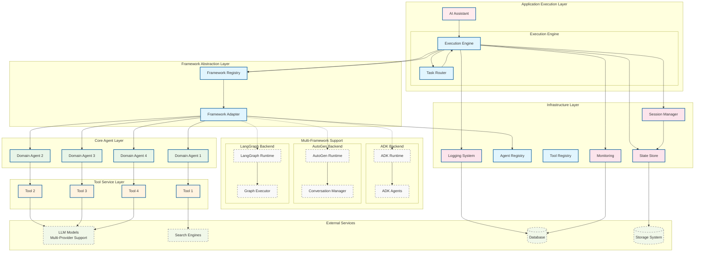
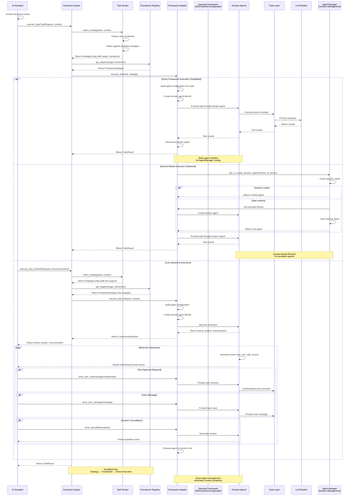
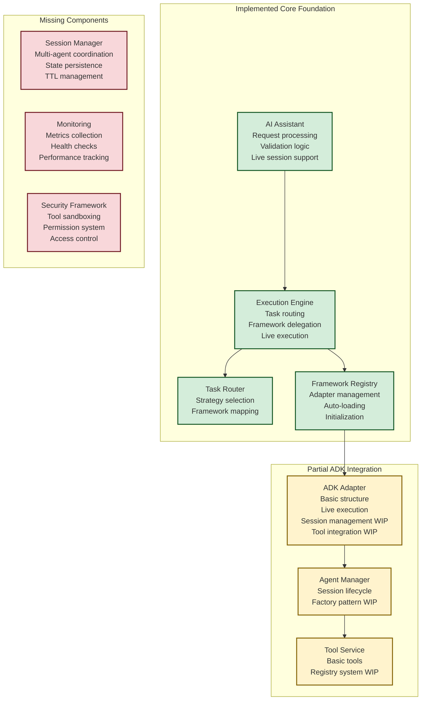

# Multi-Agent System Architecture with Framework Abstraction

## System Overview

Multi-Framework Agent System with Flexible Execution Engine - Backend Architecture Design with Framework Abstraction Layer

This architecture supports multiple agent frameworks (ADK, AutoGen, LangGraph) through a unified abstraction layer, enabling framework switching without application logic changes. The system features a flexible execution engine that supports multiple execution patterns (workflow, reactive, planning) through a strategy-based approach, allowing for both deterministic and adaptive task processing.

## Core Architecture

### 1. Backend System Architecture



### 2. Agent Collaboration Flow



## Core Components

### Framework Abstraction Layer

#### Framework Adapter
- **Role**: Unified interface for different agent frameworks (ADK, AutoGen, LangGraph)
- **Function**: Translates high-level orchestration commands to framework-specific operations
- **Live Execution**: Supports real-time bidirectional communication through `execute_task_live()` method
- **Streaming Capabilities**: Enables interactive workflows with tool approval, user input, and real-time cancellation
- **Configuration**: Runtime framework selection based on task requirements or configuration
- **Benefits**: Framework-agnostic development, easy migration between frameworks

#### Framework Registry
- **Role**: Central registry for framework adapter management
- **Function**: Manages framework adapter instances, provides factory methods, handles lifecycle
- **Configuration**: Dynamic framework registration and adapter creation
- **Benefits**: Centralized framework management, easy framework discovery and switching

### Application Execution Layer

#### AI Assistant
- **Role**: Analyze incoming tasks and route to execution engine
- **Decision Logic**: Evaluate task characteristics to determine routing needs  
- **Routing**: Direct tasks to Execution Engine for processing
- **Dependencies**: Access to Infrastructure Layer services for context management

#### Execution Engine

The Execution Engine provides a simplified, direct approach to framework-based task execution.

**Core Responsibilities**:
- **Strategy Selection**: Uses TaskRouter to analyze and select appropriate execution strategy
- **Framework Routing**: Directly maps strategy to framework adapter via FrameworkRegistry
- **Task Execution**: Delegates execution to selected framework adapter (sync and live modes)
- **Live Session Management**: Coordinates real-time interactive execution sessions
- **Result Management**: Returns unified TaskResult or LiveExecutionResult regardless of underlying framework

**Task Router**:
- **Role**: Analyze task characteristics and select appropriate execution strategy
- **Function**: Routes tasks based on task requirements and complexity analysis
- **Strategy Management**: Maintains and matches against available strategy configurations
- **Decision Logic**: Rule-based strategy selection with priority-based conflict resolution

**Key Design Principles**:
1. **Direct Framework Mapping**: Strategy configurations directly specify target frameworks
2. **Simplified Flow**: Eliminates intermediate execution layers for better performance
3. **Framework Agnostic**: Consistent behavior regardless of underlying framework
4. **Configuration Driven**: Strategy-framework mapping managed through configuration

### Core Agent Layer

#### Domain Agents
- **Role**: Execute specific domain tasks as assigned by Coordinator
- **Flexible Design**: Agent capabilities defined dynamically based on business requirements
- **Tool Integration**: Each domain agent can access appropriate tools for their tasks
- **Model Selection**: TBD - Appropriate model selection based on task complexity

**Domain Agent Examples**:
- Domain Agent 1: Execute task using Tool 1
- Domain Agent 2: Execute task using Tool 2  
- Domain Agent 3: Execute task using Tool 3
- Domain Agent 4: Execute task using Tool 4

*Note: Specific domain responsibilities and tool definitions will be determined during implementation based on actual business needs*

### Infrastructure Layer

#### Session Manager
- **Role**: Session lifecycle management and state persistence
- **Function**: Manages SessionContext across user interactions and framework boundaries
- **Features**: Session creation, state synchronization, TTL management, cleanup
- **Integration**: Used by Framework Abstraction Layer for consistent session handling

#### Framework Runtime (ADK Primary)
- **Role**: Agent lifecycle management, model invocation, error handling
- **Configuration**: Google Cloud project, Vertex AI integration for ADK; extensible for other frameworks  
- **Features**: Performance monitoring, framework-specific optimizations
- **Framework Support**: ADK as primary runtime, with abstraction layer for AutoGen/LangGraph integration

#### State Store
- **Role**: State persistence, data consistency guarantee
- **Implementation**: In-memory version (MVP) → ADK internal memory components → Distributed storage (if needed)
- **Pattern**: Session/User/Global three-layer state management
- **Note**: Initial implementation will be pure in-memory, migration path TBD based on requirements

## System Implementation Status

### Current System State



### Business Requirements vs Current Capabilities

| Business Requirement | Current Status | Primary Gap |
|----------------------|----------------|-------------|
| Super User Agent Creation | Partial | Dynamic tool/prompt injection missing |
| Multi-Agent Conversations | Partial | Multi-agent coordination missing |
| Real-time Streaming | Implemented | ADK live execution working |
| Tool Integration | Partial | Registry and security missing |
| Session Persistence | Missing | No persistent state management |
| User Management | Missing | No user/permission system |

### Next Phase Focus

The system has a solid foundation with working ADK integration and streaming capabilities. The primary focus should be completing the ADK-based multi-agent system before expanding to other frameworks.

**Critical Path**: Complete ADK session management → Tool registry → Multi-agent coordination → Security framework

## Detailed Module Breakdown

### 1. Execution Engine Module
**Status**: Implemented  
**Next Steps**: Configuration enhancement and advanced routing

### 2. Framework Abstraction Layer
**Status**: ADK adapter partially implemented  
**Next Steps**: Complete session management, add tool integration

### 3. Agent Layer
**Status**: Session lifecycle basic implementation  
**Next Steps**: Factory pattern completion, multi-agent coordination

### 4. Tool Service Layer
**Status**: Basic tools exist  
**Next Steps**: Registry system, security sandbox

### 5. Infrastructure Services
**Status**: Missing core components  
**Next Steps**: Session manager, monitoring, security framework

## Key Architecture Decisions

### Multi-Session Strategy
Given business requirement for users to interact with multiple agents simultaneously, the system uses session isolation with independent ADK runners. This provides clean separation but requires careful resource management.

### Framework-First Approach
ADK serves as the primary framework with abstraction layer designed for future multi-framework support. Core business logic remains framework-agnostic.

### Live Execution Design
Real-time bidirectional communication implemented through framework adapters, enabling interactive workflows with tool approval and user intervention.

## Technical Decisions

### 1. Communication Pattern
- **State Sharing**: Use ADK context.state for inter-agent data transfer
- **Async Execution**: Support parallel agent execution for performance
- **Framework Registry**: Centralized framework adapter management and discovery

### 2. Scaling Strategy
- **Horizontal Scaling**: Support multi-pod deployment with load balancing
- **Vertical Scaling**: Dynamic agent resource adjustment based on load
- **Modular Design**: Loose coupling design for independent component scaling
- **Framework Isolation**: Each framework adapter can scale independently

### 3. Execution Strategy Design
- **Configuration Driven**: Strategy-framework mapping through configuration files
- **Direct Framework Routing**: Strategies directly specify target frameworks
- **Simplified Architecture**: Eliminates unnecessary intermediate layers
- **Framework Agnostic**: Consistent behavior across ADK, AutoGen, and LangGraph frameworks

### 4. Live Execution and Streaming Strategy
- **Bidirectional Communication**: Real-time event streaming with user interaction support
- **Framework Integration**: Live execution capabilities exposed through framework adapters
- **Event Conversion**: ADK events converted to unified TaskStreamChunk format
- **Interactive Workflows**: Built-in support for tool approval and user intervention scenarios
- **Session Management**: Proper lifecycle handling for long-running interactive sessions

## Security and Compliance

*Implementation details TBD - will be defined based on production requirements*

### Access Control
- TBD: Authentication and authorization mechanisms
- TBD: API security configurations
- TBD: Session management policies

### Data Protection
- TBD: Input validation and sanitization strategies
- TBD: Data privacy and protection measures
- TBD: Audit logging specifications

### Monitoring and Alerting
- TBD: Performance monitoring setup
- TBD: Error tracking and alerting systems
- TBD: System health monitoring

## Core Technical Challenges and Solutions

### Implementation Roadmap Overview

| Problem Domain | Technical Challenge | Short-term Solution | Specific Implementation | Complexity | Risk |
|---|---|---|---|---|---|
| **ADK Runner/Runtime管理** | 单用户需要多个ADK Runner实例，每个Agent一个Runner | 构建ADKRuntimeManager统一管理Runner池 | `ADKRuntimeManager`类 + `RunnerPool`组件 + Runner生命周期管理 | Medium | **HIGH** |
| **Session协调与切换** | UI需要在多个Agent对话间切换，保持上下文 | 实现UserSessionCoordinator管理用户的多个Session | `UserSessionCoordinator`类 + Session状态缓存 + 切换API | Medium | Medium |
| **ADK Session状态管理** | ADK Session重启后状态丢失，需要持久化 | SessionStateManager提供状态快照和恢复 | `SessionStateManager`类 + 内存缓存 + 定期快照机制 | Low | Medium |
| **资源控制与监控** | 多Runner可能消耗过多系统资源 | ResourceGovernor实现配额管理和监控 | `ResourceGovernor`类 + 用户配额 + 资源监控组件 | Low | Low |
| **工具注册与安全执行** | 动态工具需要安全隔离执行环境 | ToolRegistry + 子进程隔离执行 | `SecureToolRegistry`类 + `ToolExecutor`组件 + 权限验证 | Medium | **HIGH** |
| **非Streaming请求处理** | 当前系统主要支持streaming，需要同步请求模式 | 在ADK Adapter中添加同步执行模式 | `execute_task_sync()`方法 + 结果等待机制 | Low | Low |

### Critical Path Dependencies

**Phase 1 (优先级顺序)**:
1. **ADK Runner/Runtime管理** - 基础设施，必须先完成
2. **非Streaming请求支持** - 简化MVP实现
3. **Session协调与切换** - 核心用户体验
4. **工具注册与安全** - 安全基础

**Phase 2 (生产就绪)**:
5. **资源控制与监控** - 生产环境必需
6. **Session状态持久化** - 可靠性保障
7. **Streaming支持** - 用户体验增强

### Specific Implementation Modules

#### 1. ADK Runtime Manager (最高优先级)
```python
# 位置: src/aether_frame/framework/adk/runtime_manager.py
class ADKRuntimeManager:
    """统一管理ADK Runner实例的生命周期"""
    
class RunnerPool:
    """Runner实例池，支持复用和预热"""
    
class RunnerLifecycleController:
    """Runner创建、初始化、清理的生命周期控制"""
```

#### 2. User Session Coordinator  
```python
# 位置: src/aether_frame/agents/user_session_coordinator.py
class UserSessionCoordinator:
    """管理单用户的多Agent Session协调"""
    
class SessionSwitcher:
    """处理Session间的切换逻辑"""
```

#### 3. Session State Manager
```python  
# 位置: src/aether_frame/infrastructure/session_state_manager.py
class SessionStateManager:
    """ADK Session状态的持久化和恢复"""
    
class StateSnapshotScheduler:
    """定期状态快照调度器"""
```

#### 4. Resource Governance
```python
# 位置: src/aether_frame/infrastructure/resource_governor.py 
class ResourceGovernor:
    """资源配额管理和监控"""
    
class UserQuotaManager:
    """用户级别的资源配额管理"""
```

#### 5. Tool Registry & Security
```python
# 位置: src/aether_frame/tools/secure_tool_registry.py
class SecureToolRegistry:
    """工具注册和安全执行管理"""
    
class ToolExecutor:
    """工具的隔离执行环境"""
```

### Risk Mitigation Strategy

**高风险项目**:
- **ADK Runner管理**: Week 1前3天构建原型，验证多Runner资源消耗
- **工具安全执行**: 优先使用subprocess隔离，避免复杂容器化方案

**中等风险项目**:
- **Session状态管理**: 先用内存缓存，后续迁移到持久存储
- **Session协调**: 先支持基本切换，后续优化性能

## Performance Targets

*Performance specifications TBD - will be defined based on testing and production requirements*

### MVP Phase
- TBD: Response time targets
- TBD: Concurrency requirements  
- TBD: Availability expectations
- TBD: Success rate thresholds

### Production Environment
- TBD: Production response time goals
- TBD: Production concurrency capacity
- TBD: Production availability targets
- TBD: Production success rate requirements

---