# Multi-Agent System Architecture with Framework Abstraction

## System Overview

Multi-Framework Agent System with ADK Primary Implementation - Backend Architecture Design with Framework Abstraction Layer

This architecture supports multiple agent frameworks (ADK, AutoGen, LangGraph) through a unified abstraction layer, enabling framework switching without application logic changes. **Current implementation focuses on ADK as the primary framework**, featuring a flexible execution engine that supports agent lifecycle management, session persistence, and multi-turn conversations. For ADK we adopt a **controlled reuse** model: agents/runners built for a given configuration can be reused across requests, business clients keep the same `chat_session_id` to maintain context, and cleanup hooks are available to reclaim runners/agents when sessions go idle or switch.

**Implementation Status:**
- ✅ **Phase 1 Complete**: ADK integration with full agent lifecycle and session management
- 🚧 **Phase 2 Partial**: Tool service and live execution capabilities  
- 📋 **Phase 3 Future**: Multi-framework support (AutoGen, LangGraph)

## Core Architecture

### 1. Backend System Architecture (Current Implementation)


### 2. Agent Execution Flow (Current Implementation)


## Core Components (Current Implementation)

### Framework Abstraction Layer

#### ADK Framework Adapter (✅ Implemented)
- **Role**: Primary framework adapter implementing unified interface for ADK
- **Function**: Handles three execution modes (agent_id+session_id, agent_id only, agent_config only)
- **Session Management**: Integrates with RunnerManager for ADK session lifecycle
- **Agent Integration**: Coordinates with AgentManager for agent lifecycle
- **Benefits**: Full ADK integration with session persistence and multi-turn conversations

#### Framework Registry (✅ Implemented)  
- **Role**: Central registry for framework adapter management
- **Function**: Auto-loads ADK adapter, provides adapter discovery and lifecycle
- **Current Focus**: ADK-primary with extensible design for future frameworks
- **Benefits**: Centralized framework management with capability-driven configuration

### Application Execution Layer

#### AI Assistant (✅ Implemented)
- **Role**: Main system entry point for task processing
- **Function**: Request validation, bootstrap integration, result formatting
- **Live Support**: Basic live session support (under development)
- **Integration**: Direct bootstrap integration for easy initialization

#### Execution Engine (✅ Implemented)
- **Role**: Task orchestration and framework routing coordinator  
- **Function**: Routes all tasks to ADK via TaskRouter, handles three execution modes
- **Session Support**: Full support for agent_id + session_id architecture
- **Error Handling**: Comprehensive error handling with proper session context

#### Task Router (✅ Implemented)
- **Role**: Framework selection and execution strategy determination
- **Current Logic**: ADK-first routing with complexity analysis
- **Future Ready**: Extensible design for multi-framework routing
- **Strategy**: Returns ExecutionStrategy optimized for ADK execution

### Core Agent Layer

#### Agent Manager (✅ Implemented)
- **Role**: Agent lifecycle management and registry
- **Function**: Create, store, track, and cleanup agent instances  
- **Integration**: Works with AdkFrameworkAdapter for agent registration
- **Health Monitoring**: Agent health checks and statistics tracking

#### ADK Domain Agent (✅ Implemented)
- **Role**: Framework-specific agent implementation for ADK
- **Function**: Direct ADK integration with runtime context handling
- **Session Context**: Processes AgentRequest with session_id propagation
- **Tool Integration**: Integrates with ToolService for tool execution

#### Runner Manager (✅ Implemented)
- **Role**: ADK-specific session and runner lifecycle management
- **Function**: Create, manage, and cleanup ADK runners and sessions
- **Session Storage**: Handles persistent ADK session state
- **Resource Management**: Proper cleanup and resource tracking

### Tool Service Layer (🚧 Partial Implementation)

#### Tool Service (✅ Basic Implementation)
- **Role**: Unified tool execution interface
- **Current Support**: Builtin tools (echo, timestamp, chat_log)
- **Planned Support**: MCP tools, ADK native tools, external API tools
- **Integration**: Ready for agent tool execution

### Infrastructure Layer (✅ Implemented)

#### Bootstrap System (✅ Implemented)  
- **Role**: System initialization and component coordination
- **Function**: 5-phase initialization (Registry → Tools → ADK → Agents → Engine)
- **Dependency Management**: Proper component startup order and dependency injection
- **Health Checks**: System-wide health monitoring capabilities

#### Configuration System (✅ Implemented)
- **Settings**: Application configuration management
- **Environment**: Environment variable handling
- **Framework Capabilities**: ADK capability configuration
- **Routing Config**: Strategy configuration for framework routing

## System Implementation Status

### Current System State (Updated September 2024)

```mermaid
graph TB
    subgraph "✅ Fully Implemented Components"
        AI[AI Assistant<br/>✅ Request processing<br/>✅ Validation logic<br/>✅ Bootstrap integration]
        EE[Execution Engine<br/>✅ Task routing<br/>✅ Framework delegation<br/>✅ Three execution modes]
        TR[Task Router<br/>✅ ADK-first strategy<br/>✅ Complexity analysis<br/>✅ Future-ready design]
        FR[Framework Registry<br/>✅ ADK adapter auto-load<br/>✅ Capability management<br/>✅ Health monitoring]
    end
    
    subgraph "✅ ADK Integration Complete"
        ADK[ADK Adapter<br/>✅ Three execution modes<br/>✅ Session management<br/>✅ Agent integration<br/>✅ Runtime context]
        AM[Agent Manager<br/>✅ Agent lifecycle<br/>✅ Health monitoring<br/>✅ Statistics tracking]
        RM[Runner Manager<br/>✅ ADK session management<br/>✅ Resource cleanup<br/>✅ Storage integration]
        DA[ADK Domain Agent<br/>✅ ADK runtime integration<br/>✅ Session context<br/>✅ Tool integration]
    end
    
    subgraph "🚧 Partially Implemented"
        TOOLS[Tool Service<br/>✅ Basic builtin tools<br/>🚧 MCP integration<br/>🚧 ADK native tools<br/>🚧 External API tools]
        LIVE[Live Execution<br/>🚧 Basic framework<br/>🚧 Stream handling<br/>📋 Interactive features]
    end
    
    subgraph "✅ Infrastructure Complete"
        BOOT[Bootstrap System<br/>✅ 5-phase initialization<br/>✅ Dependency management<br/>✅ Health checks]
        CONFIG[Configuration<br/>✅ Settings management<br/>✅ Environment handling<br/>✅ Framework capabilities]
        LOG[Logging System<br/>✅ Unified logging<br/>✅ Execution chains<br/>✅ Performance tracking]
    end
    
    AI --> EE
    EE --> TR
    EE --> FR
    FR --> ADK
    ADK --> AM
    ADK --> RM
    AM --> DA
    DA --> TOOLS
    
    BOOT --> AI
    BOOT --> CONFIG
    BOOT --> LOG
    
    classDef implemented fill:#d4edda,stroke:#155724,stroke-width:2
    classDef partial fill:#fff3cd,stroke:#856404,stroke-width:2
    classDef placeholder fill:#f8d7da,stroke:#721c24,stroke-width:2
    
    class AI,EE,TR,FR implemented
    class ADK,AM,RM,DA implemented
    class BOOT,CONFIG,LOG implemented
    class TOOLS,LIVE partial
```



### Business Requirements vs Current Capabilities (Updated)

| Business Requirement | Current Status | Implementation Details |
|----------------------|----------------|------------------------|
| **Agent Creation & Management** | ✅ Fully Implemented | Three modes: new agent, existing agent new session, continue session |
| **Multi-turn Conversations** | ✅ Fully Implemented | agent_id + session_id architecture with persistent state |
| **Session Management** | ✅ Fully Implemented | RunnerManager + AgentManager with proper lifecycle |
| **ADK Integration** | ✅ Fully Implemented | Complete ADK runtime integration with model support |
| **Tool Integration** | 🚧 Basic Implementation | Builtin tools working, MCP/ADK native planned |
| **Real-time Streaming** | 🚧 Framework Ready | Basic implementation, interactive features in development |
| **Configuration Management** | ✅ Fully Implemented | Settings, environment, capabilities configuration |
| **Bootstrap & Health** | ✅ Fully Implemented | 5-phase initialization with comprehensive health checks |

### Next Phase Focus

The system has a solid foundation with working ADK integration and streaming capabilities. The primary focus should be completing the ADK-based multi-agent system before expanding to other frameworks.

**Critical Path**: Complete ADK session management → Tool registry → Multi-agent coordination → Security framework

## Detailed Module Breakdown

### 1. Execution Engine Module
**Status**: Implemented  
**Next Steps**: Configuration enhancement and advanced routing

### 2. Framework Abstraction Layer
**Status**: ADK adapter partially implemented  
**Next Steps**: Complete session management, add tool integration

### 3. Agent Layer
**Status**: Session lifecycle basic implementation  
**Next Steps**: Factory pattern completion, multi-agent coordination

### 4. Tool Service Layer
**Status**: Basic tools exist  
**Next Steps**: Registry system, security sandbox

### 5. Infrastructure Services
**Status**: Missing core components  
**Next Steps**: Session manager, monitoring, security framework

## Key Architecture Decisions

### Multi-Session Strategy
Given business requirement for users to interact with multiple agents simultaneously, the system uses session isolation with independent ADK runners. This provides clean separation but requires careful resource management.

### Framework-First Approach
ADK serves as the primary framework with abstraction layer designed for future multi-framework support. Core business logic remains framework-agnostic.

### Live Execution Design
Real-time bidirectional communication implemented through framework adapters, enabling interactive workflows with tool approval and user intervention.

## Technical Decisions

### 1. Communication Pattern
- **State Sharing**: Use ADK context.state for inter-agent data transfer
- **Async Execution**: Support parallel agent execution for performance
- **Framework Registry**: Centralized framework adapter management and discovery

### 2. Scaling Strategy
- **Horizontal Scaling**: Support multi-pod deployment with load balancing
- **Vertical Scaling**: Dynamic agent resource adjustment based on load
- **Modular Design**: Loose coupling design for independent component scaling
- **Framework Isolation**: Each framework adapter can scale independently

### 3. Execution Strategy Design
- **Configuration Driven**: Strategy-framework mapping through configuration files
- **Direct Framework Routing**: Strategies directly specify target frameworks
- **Simplified Architecture**: Eliminates unnecessary intermediate layers
- **Framework Agnostic**: Consistent behavior across ADK, AutoGen, and LangGraph frameworks

### 4. Live Execution and Streaming Strategy
- **Bidirectional Communication**: Real-time event streaming with user interaction support
- **Framework Integration**: Live execution capabilities exposed through framework adapters
- **Event Conversion**: ADK events converted to unified TaskStreamChunk format
- **Interactive Workflows**: Built-in support for tool approval and user intervention scenarios
- **Session Management**: Proper lifecycle handling for long-running interactive sessions

## Security and Compliance

*Implementation details TBD - will be defined based on production requirements*

### Access Control
- TBD: Authentication and authorization mechanisms
- TBD: API security configurations
- TBD: Session management policies

### Data Protection
- TBD: Input validation and sanitization strategies
- TBD: Data privacy and protection measures
- TBD: Audit logging specifications

### Monitoring and Alerting
- TBD: Performance monitoring setup
- TBD: Error tracking and alerting systems
- TBD: System health monitoring

## Core Technical Challenges and Solutions

### Implementation Roadmap Overview

| Problem Domain | Technical Challenge | Short-term Solution | Specific Implementation | Complexity | Risk |
|---|---|---|---|---|---|
| **ADK Runner/Runtime管理** | 单用户需要多个ADK Runner实例，每个Agent一个Runner | 构建ADKRuntimeManager统一管理Runner池 | `ADKRuntimeManager`类 + `RunnerPool`组件 + Runner生命周期管理 | Medium | **HIGH** |
| **Session协调与切换** | UI需要在多个Agent对话间切换，保持上下文 | 实现UserSessionCoordinator管理用户的多个Session | `UserSessionCoordinator`类 + Session状态缓存 + 切换API | Medium | Medium |
| **ADK Session状态管理** | ADK Session重启后状态丢失，需要持久化 | SessionStateManager提供状态快照和恢复 | `SessionStateManager`类 + 内存缓存 + 定期快照机制 | Low | Medium |
| **资源控制与监控** | 多Runner可能消耗过多系统资源 | ResourceGovernor实现配额管理和监控 | `ResourceGovernor`类 + 用户配额 + 资源监控组件 | Low | Low |
| **工具注册与安全执行** | 动态工具需要安全隔离执行环境 | ToolRegistry + 子进程隔离执行 | `SecureToolRegistry`类 + `ToolExecutor`组件 + 权限验证 | Medium | **HIGH** |
| **非Streaming请求处理** | 当前系统主要支持streaming，需要同步请求模式 | 在ADK Adapter中添加同步执行模式 | `execute_task_sync()`方法 + 结果等待机制 | Low | Low |

### Critical Path Dependencies

**Phase 1 (优先级顺序)**:
1. **ADK Runner/Runtime管理** - 基础设施，必须先完成
2. **非Streaming请求支持** - 简化MVP实现
3. **Session协调与切换** - 核心用户体验
4. **工具注册与安全** - 安全基础

**Phase 2 (生产就绪)**:
5. **资源控制与监控** - 生产环境必需
6. **Session状态持久化** - 可靠性保障
7. **Streaming支持** - 用户体验增强

### Specific Implementation Modules

#### 1. ADK Runtime Manager (最高优先级)
```python
# 位置: src/aether_frame/framework/adk/runtime_manager.py
class ADKRuntimeManager:
    """统一管理ADK Runner实例的生命周期"""
    
class RunnerPool:
    """Runner实例池，支持复用和预热"""
    
class RunnerLifecycleController:
    """Runner创建、初始化、清理的生命周期控制"""
```

#### 2. User Session Coordinator  
```python
# 位置: src/aether_frame/agents/user_session_coordinator.py
class UserSessionCoordinator:
    """管理单用户的多Agent Session协调"""
    
class SessionSwitcher:
    """处理Session间的切换逻辑"""
```

#### 3. Session State Manager
```python  
# 位置: src/aether_frame/infrastructure/session_state_manager.py
class SessionStateManager:
    """ADK Session状态的持久化和恢复"""
    
class StateSnapshotScheduler:
    """定期状态快照调度器"""
```

#### 4. Resource Governance
```python
# 位置: src/aether_frame/infrastructure/resource_governor.py 
class ResourceGovernor:
    """资源配额管理和监控"""
    
class UserQuotaManager:
    """用户级别的资源配额管理"""
```

#### 5. Tool Registry & Security
```python
# 位置: src/aether_frame/tools/secure_tool_registry.py
class SecureToolRegistry:
    """工具注册和安全执行管理"""
    
class ToolExecutor:
    """工具的隔离执行环境"""
```

### Risk Mitigation Strategy

**高风险项目**:
- **ADK Runner管理**: Week 1前3天构建原型，验证多Runner资源消耗
- **工具安全执行**: 优先使用subprocess隔离，避免复杂容器化方案

**中等风险项目**:
- **Session状态管理**: 先用内存缓存，后续迁移到持久存储
- **Session协调**: 先支持基本切换，后续优化性能

## Performance Targets

*Performance specifications TBD - will be defined based on testing and production requirements*

### MVP Phase
- TBD: Response time targets
- TBD: Concurrency requirements  
- TBD: Availability expectations
- TBD: Success rate thresholds

### Production Environment
- TBD: Production response time goals
- TBD: Production concurrency capacity
- TBD: Production availability targets
- TBD: Production success rate requirements

---
