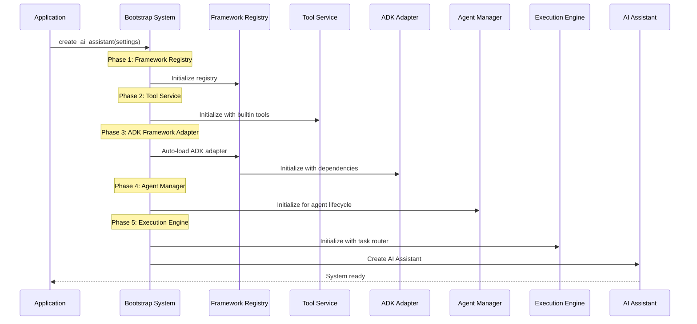
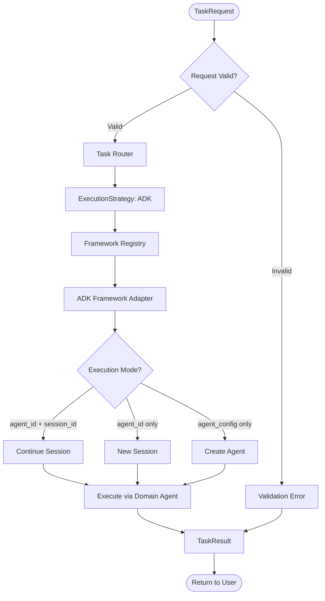
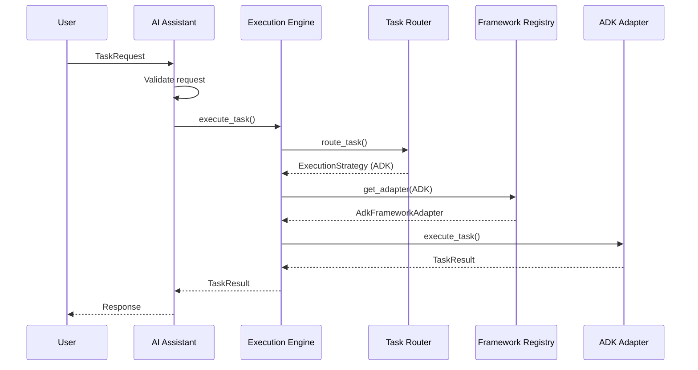
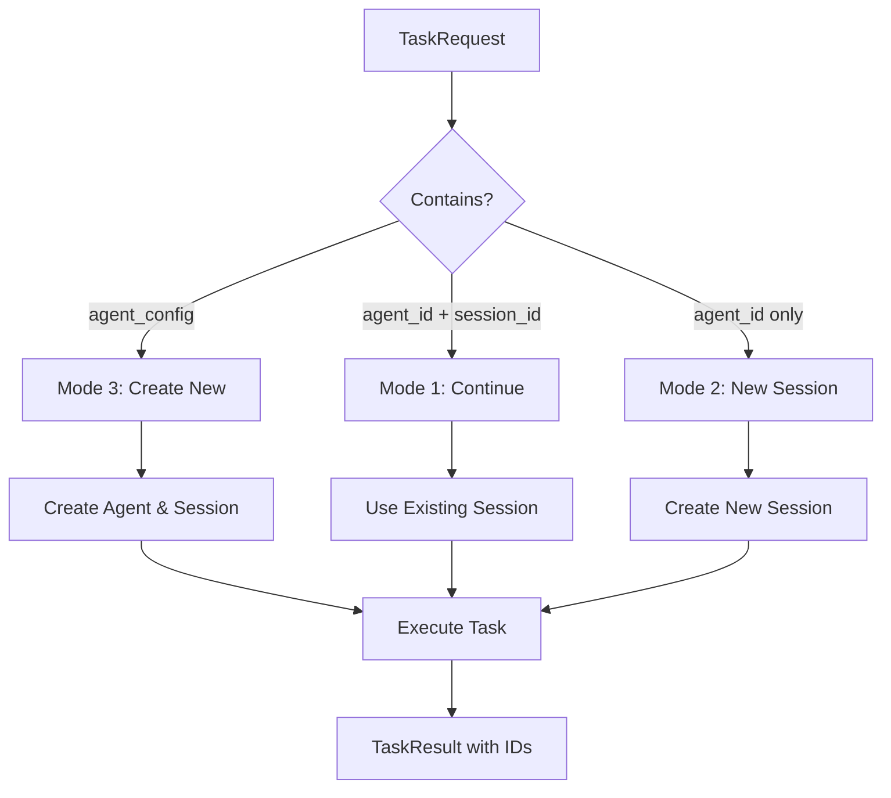
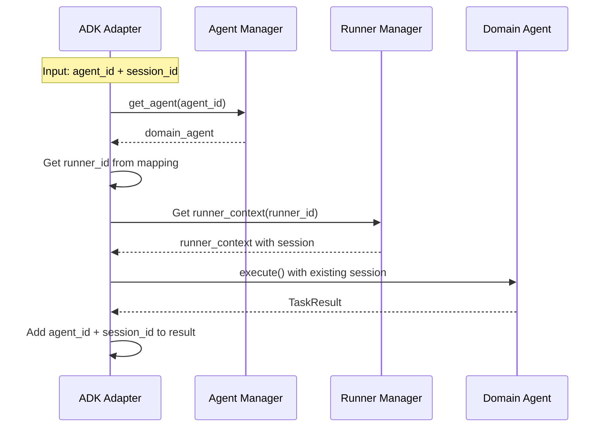
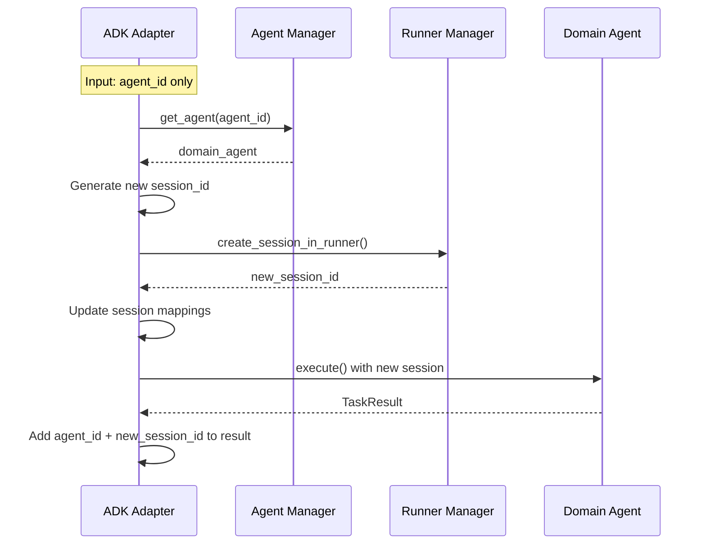
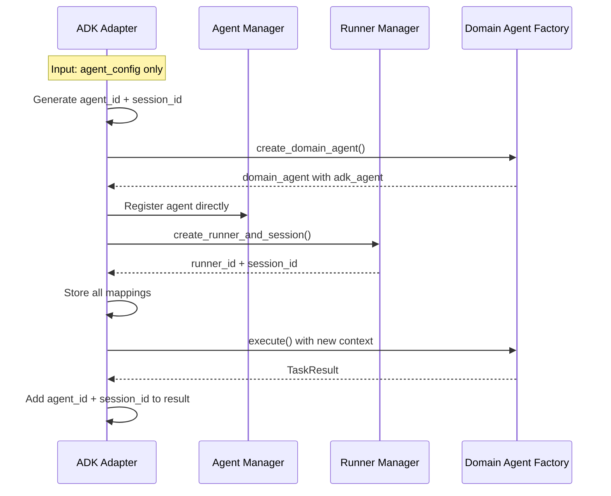
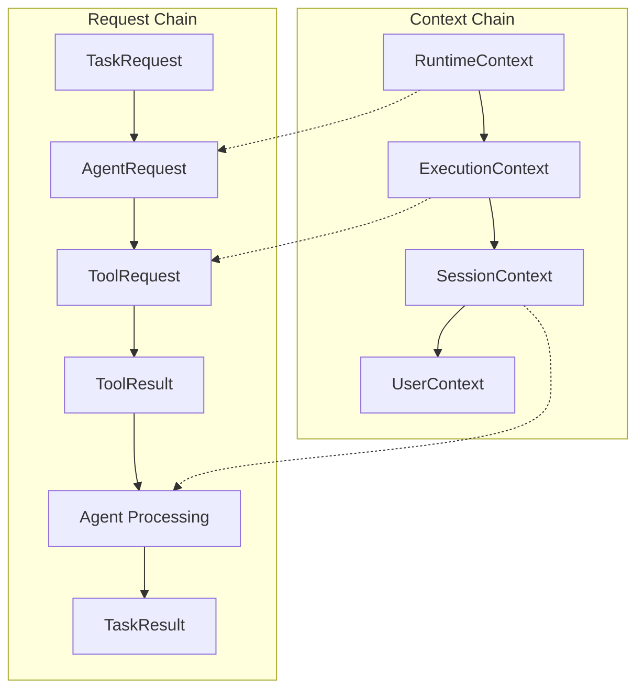
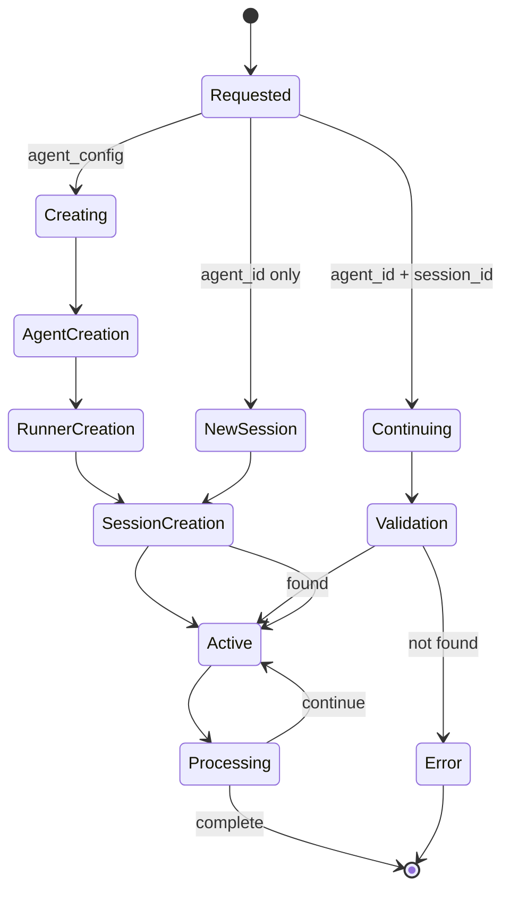
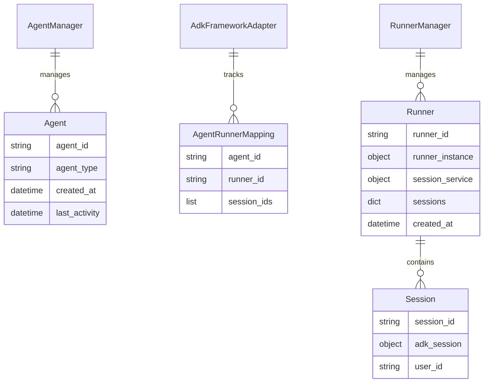

# Aether Frame - Core Execution Flow and Data Transformation

## Overview

This document focuses on the core execution flow and key data transformations in Aether Frame. It provides essential flow diagrams and data mapping without implementation details.

**Last Updated**: September 2024  
**Implementation Status**: ADK-First Implementation Complete

---

## Table of Contents

1. [System Bootstrap Flow](#system-bootstrap-flow)
2. [Core Request Processing Flow](#core-request-processing-flow)
3. [Three Execution Modes](#three-execution-modes)
4. [Data Transformation Pipeline](#data-transformation-pipeline)
5. [Session Management Flow](#session-management-flow)
6. [Error Handling Flow](#error-handling-flow)

---

## System Bootstrap Flow

### 5-Phase Initialization

---

## Core Request Processing Flow

### High-Level Flow

### Component Flow

---

## Three Execution Modes

### Mode Overview

### Mode 1: Continue Existing Session

### Mode 2: New Session for Existing Agent

### Mode 3: Create New Agent and Session

---

## Data Transformation Pipeline

### Complete Data Flow Chain

### Data Transformation Interfaces

#### 1. TaskRequest → AgentRequest
**Interface**: `AdkFrameworkAdapter.execute_task() → AdkDomainAgent.execute()`
- **Input**: TaskRequest with agent_id/session_id/agent_config
- **Context**: RuntimeContext built from agent, runner, session state
- **Output**: AgentRequest with unified runtime_options

#### 2. AgentRequest → ToolRequest (Internal ADK Flow)
**Interface**: `AdkDomainAgent._get_adk_tools() → chat_log_function()`
- **Input**: ADK tool invocation during agent execution
- **Transform**: ADK parameters → ToolRequest structure 
- **Context**: session_id, tool_service from runtime_context

#### 3. ToolRequest → ToolResult
**Interface**: `ChatLogTool.execute(tool_request) → ToolResult`
- **Input**: ToolRequest with tool_name, parameters, session_id
- **Processing**: Tool-specific execution logic
- **Output**: ToolResult with status, result_data, execution_time

#### 4. ToolResult → Agent Processing → TaskResult
**Interface**: `AdkDomainAgent._execute_with_adk_runner() → TaskResult`
- **Input**: Tool results integrated into ADK response
- **Transform**: ADK response → UniversalMessage format
- **Output**: TaskResult with agent_id/session_id for continuation

### Context Construction and Passing

#### RuntimeContext Building
**Interface**: `AdkFrameworkAdapter._build_runtime_context()`
- **Sources**: AgentManager, RunnerManager, session mappings
- **Fields**: session_id, user_id, agent_id, framework_session, runner_context
- **Usage**: Passed to domain agent for execution context

#### Context Propagation Flow
1. **TaskRequest Context**: agent_id, session_id preserved throughout chain
2. **RuntimeContext Assembly**: Framework adapter builds from multiple sources
3. **AgentRequest Context**: RuntimeContext passed as runtime_options
4. **Tool Execution Context**: session_id extracted for tool requests
5. **TaskResult Context**: agent_id/session_id added for continuation

---

## Session Management Flow

### Session Lifecycle States

### Storage Structure

---

## Summary

**Core Execution Pattern:**
1. **Bootstrap**: 5-phase system initialization
2. **Request**: Validation → Routing → Framework Selection
3. **Execution**: Three modes based on input (continue/new session/create agent)
4. **Response**: Enhanced with agent_id + session_id for follow-up

**Key Data Transformations:**
- TaskRequest → ExecutionStrategy (complexity analysis)
- TaskRequest → AgentRequest (runtime context assembly)
- ADK Response → TaskResult (session metadata addition)

**Session Management:**
- Persistent agent storage via AgentManager
- ADK session lifecycle via RunnerManager  
- Multi-session support per agent
- Clean error handling with context preservation

This document will be updated when core execution flows or data transformation processes change.