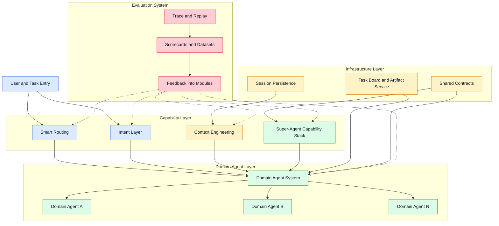
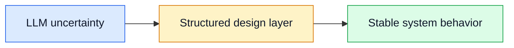
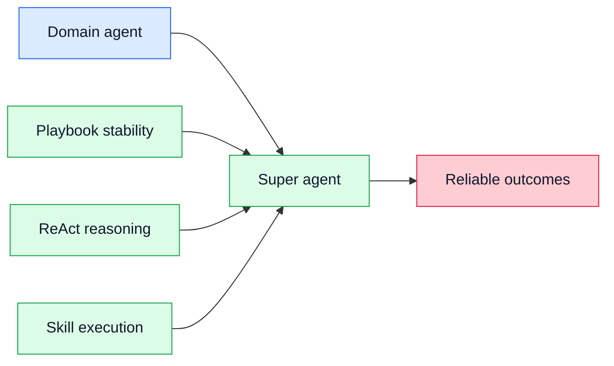
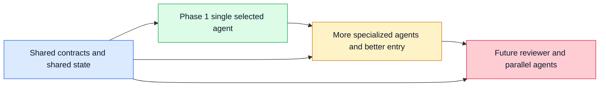

# Building a Smarter Agent System

Status: Working direction

Objective: build an agent system that becomes increasingly smart by improving five modules together: intent, super agents, context engineering, routing, and evaluation.

## 1. Concept Alignment

| Concept | Meaning in this document |
| --- | --- |
| Domain agent | An agent aligned to one domain or business lane. |
| Super agent | The capability model of a domain agent. In other words, each domain agent is a super agent. |
| Intent layer | A structured understanding layer that identifies user goal, slots, ambiguity, and clarification need. It can be shared before routing or embedded inside a super agent. |
| Smart routing | The layer that helps decide the initial domain-agent entry point. In Phase 1, it does not dynamically switch domain agents inside an active session. |
| Evaluation system | A cross-cutting system that observes all layers, builds scorecards, and drives iteration. |

Phase 1 operating rule:

- the task first enters one domain agent, either by user choice or by system recommendation
- that domain agent then owns the full multi-turn conversation until the task is complete
- dynamic mid-session switching across domain agents is out of scope for the first release

Long-term direction:

- the first release uses a single-super-agent execution model per active task session
- the broader architecture still evolves toward multi-agent collaboration when specialization, review, or parallelism becomes justified

## 2. Macro View

This is a capability-layering view, not a runtime sequence. `Smart Routing`, `Intent Layer`, `Context Engineering`, and `Super-Agent Capability Stack` are capability modules; `Domain Agent System` is the execution layer; `Infrastructure Layer` and `Evaluation System` are cross-cutting support layers. The Phase 1 runtime rule still remains: one selected domain agent owns the active task session until completion.

Human analogy:

| System part | Human analogy | What it does |
| --- | --- | --- |
| Super agent | Brain | reasons, plans, acts, and reflects |
| Context engineering | Memory system | decides what should be remembered right now |
| Skills and tools | Hands and instruments | execute bounded work |
| Intent layer | Perception and first-pass understanding | interprets what the user actually wants |
| Smart routing | Dispatcher | assigns work to the right domain agent |
| Evaluation system | Coach | measures quality and drives improvement |

## 3. Core Module Capabilities

| Module | Three core capabilities | Why these capabilities matter |
| --- | --- | --- |
| Intent layer | `intent recognition`; `slot and ambiguity detection`; `intent artifact output` | We need to understand the real user goal before planning, routing, or execution starts. |
| Super agent | `plan-execute-reflect`; `playbook-constrained execution`; `skill orchestration` | We want each domain agent to be smart, but also stable and controllable. |
| Context engineering | `stable core context`; `context-pack assembly`; `budget and compression control` | The model should see the most decision-relevant context, not the largest possible context. |
| Smart routing | `initial domain recommendation`; `role-aware entry policy`; `future-ready routing contract` | In Phase 1, the main job is to help the task enter the right domain agent, whether that entry is user-driven or system-guided, without introducing dynamic mid-session switching. |
| Evaluation system | `trace collection`; `scorecard and dataset management`; `feedback into all modules` | The system only gets smarter if we can measure failures, replay them, and update the right layer. |
| Shared infrastructure | `session persistence`; `task and artifact state`; `common contracts` | The same foundation must support the current single-agent baseline and future multi-agent evolution. |

## 4. Why Structured Design Is Necessary

LLM output is probabilistic, but system behavior cannot be.

That is why we introduce structured designs such as `playbook`, `context pack`, typed artifacts, and evaluation scorecards. These mechanisms do not try to remove model flexibility. They make the surrounding system more deterministic where determinism matters.

What structure gives us:

| Structured mechanism | What it stabilizes | Why it matters |
| --- | --- | --- |
| `Intent artifact` | understanding of user goal | reduces ambiguity before execution starts |
| `Context pack` | model-visible context | reduces drift, omission, and noisy context |
| `Playbook` | execution trajectory | reduces skipped steps and unstable task flow |
| `Artifacts and contracts` | interfaces between steps | makes replay, review, and debugging possible |
| `Evaluation scorecards` | quality feedback loop | lets us improve the system with evidence rather than intuition |

This does not remove creativity. It separates:

- what must stay stable: entry point, context shape, execution checkpoints, evidence, and evaluation
- what can stay flexible: reasoning path, wording, decomposition details, and solution generation inside the allowed space

The goal is not to make the LLM rigid. The goal is to make the system reliable enough that the LLM's creativity becomes useful instead of random.

## 5. How One Domain Agent Becomes a Super Agent

The core idea is simple:

- `Playbook-guided stability` keeps execution on a bounded and reusable path.
- `ReAct reasoning` gives the agent a flexible multi-step reasoning loop.
- `Skill-based execution` turns domain capability into reusable operational procedures.
- These three capabilities are the main reason a domain agent can behave like a super agent.

## 6. Evolution Path

This is why the infrastructure matters: it lets us improve current domain super agents now, while keeping the door open for future multi-agent collaboration on the same contracts.

Long-term multi-agent exploration remains an explicit strategic direction.

- Why explore it: some tasks will eventually need stronger specialization, explicit review, or parallel execution than one super agent can provide economically.
- What it may become: a small-number agent system such as planner, operator, reviewer, or parallel specialists, rather than a large swarm.
- What enables that path now: shared contracts around intent artifacts, context packs, playbook state, task board state, artifact URIs, and evaluation traces.
- What remains true: multi-agent is a direction to be validated by evidence, not complexity we add by default.

## Related Docs

- `docs/intent-recognition_design.md`
- `docs/artifact_store_taxonomy.md`
- `docs/plans/2026-03-13-playbook-orchestration-design.md`
- `docs/roadmaps/context_engineering_org.md`
- `docs/roadmaps/evaluation_pipeline_and_datasets.md`
- `docs/agent_system.md`
