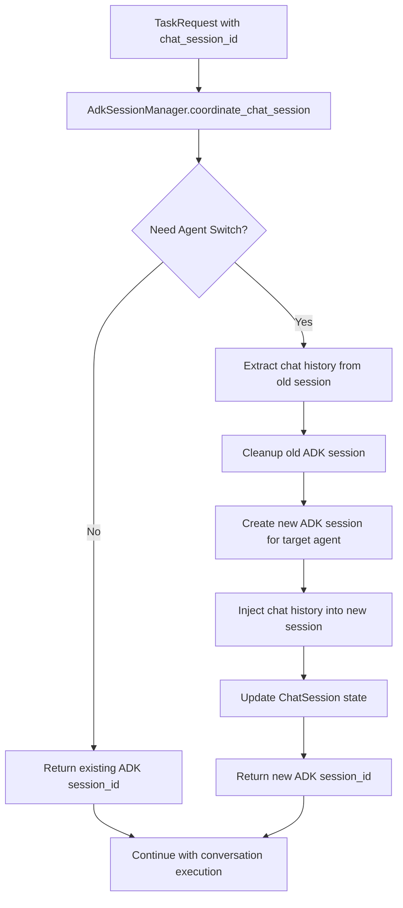

# ADK SessionManager Design Specification

## Overview

This document outlines the design and implementation of the **ADKSessionManager** component for the Aether Frame multi-agent framework. The ADKSessionManager serves as a **coordinator** that manages the relationship between business-level chat sessions and technical-level ADK sessions, enabling seamless agent switching with **chat history migration** within a unified user conversation experience.

## Business Context & Requirements

### User Experience Model
```
User (1) ↔ Chat Session (1, frontend perspective)
     ↓ Agent Switching
User (1) ↔ Multiple Agents (N) ↔ Multiple ADK Sessions (N, backend implementation)
```

### Key Requirements
1. **Single Active Session**: Each user has only one active ADK session at any time
2. **Agent Switching**: Users can switch between different agents within the same chat session
3. **Chat History Migration**: Conversation history is preserved and transferred during agent switching
4. **Session Isolation**: Each agent maintains its own conversation context after migration
5. **Resource Management**: Automatic cleanup of inactive sessions
6. **Real ADK API Integration**: Uses actual Google ADK session.state for history management
7. **Minimal Integration Impact**: No breaking changes to existing external APIs

## Architecture Design

### Core Principle: Coordinator Pattern

SessionManager acts as a **coordinator** rather than a direct session creator. It orchestrates the relationship between:
- **Business Layer**: Chat sessions (user-facing)  
- **Technical Layer**: ADK sessions (framework-specific)
- **Execution Layer**: Runners (computation units)

### Session Relationship Model
```
ChatSession (Business)
    ↓ 1:1 mapping
ActiveADKSession (Technical)
    ↓ 1:1 binding  
Runner + SessionService (Execution)
```

### Simplified Design Constraints
- **Single Active Session**: 1 Chat Session ↔ 1 Active ADK Session (max)
- **Create-Destroy Pattern**: Agent switching = Destroy old session + Create new session
- **No Session Reuse**: Eliminates complexity of session lifecycle management
- **Clean State Transitions**: Every switch results in fresh session state

## Data Models

### ChatSessionInfo
```python
@dataclass
class ChatSessionInfo:
    user_id: str
    chat_session_id: str
    
    # Single active session state
    active_agent_id: Optional[str] = None
    active_adk_session_id: Optional[str] = None  
    active_runner_id: Optional[str] = None
    
    # Metadata
    created_at: datetime = field(default_factory=datetime.now)
    last_activity: datetime = field(default_factory=datetime.now)
    last_switch_at: Optional[datetime] = None
```

### Session ID Semantics
- **TaskRequest.session_id**: Chat session ID (business layer)
- **SessionContext.session_id**: ADK session ID (technical layer)  
- **SessionContext.conversation_id**: Chat session ID (for business tracking)

## Integration Points

### Primary Integration: ADKAdapter._handle_conversation

**Integration Timing**: Within conversation pattern, after pattern determination

```python
async def _handle_conversation(self, task_request: TaskRequest, strategy: ExecutionStrategy):
    # === ADKSessionManager Coordination (IMPLEMENTED) ===
    coordination_result = await self.adk_session_manager.coordinate_chat_session(
        chat_session_id=task_request.session_id,
        target_agent_id=task_request.agent_id,
        user_id=task_request.user_context.get_adk_user_id(),
        task_request=task_request,
        runner_manager=self.runner_manager
    )
    
    # Replace chat_session_id with adk_session_id
    original_session_id = task_request.session_id
    task_request.session_id = coordination_result.adk_session_id
    
    if coordination_result.switch_occurred:
        self.logger.info(f"Session switch completed: "
                       f"chat_session={original_session_id}, "
                       f"{coordination_result.previous_agent_id} -> "
                       f"{coordination_result.new_agent_id}")
    
    # === Existing Pattern Logic (UNCHANGED) ===
    runtime_context = await self._create_runtime_context_for_existing_session(task_request)
    domain_agent = runtime_context.metadata.get("domain_agent")
    result = await self._execute_with_domain_agent(task_request, runtime_context, domain_agent)
```

### Secondary Integration: RunnerManager

**SessionService Injection** (IMPLEMENTED):
```python
# runner_manager.py - Current Implementation
class RunnerManager:
    def __init__(self, settings=None, session_manager=None, agent_runner_mapping=None):
        self.session_manager = session_manager
        self.agent_runner_mapping = agent_runner_mapping or {}
    
    async def _create_session_in_runner(self, runner_id: str, external_session_id: str):
        session_service = self.session_manager.create_session_service() if self.session_manager else InMemorySessionService()
        # Create session with injected service
    
    async def get_runner_for_agent(self, agent_id: str) -> str:
        # Use injected agent_runner_mapping
        runner_id = self.agent_runner_mapping.get(agent_id)
        if not runner_id:
            raise RuntimeError(f"No runner found for agent_id: {agent_id}")
        return runner_id
```

## Core Workflow

### Chat Session Coordination with History Migration


### Agent Switching with Chat History Migration
1. **Request Analysis**: Extract chat_session_id, target_agent_id, user_id
2. **State Check**: Compare target_agent_id with current active_agent_id
3. **History Extraction**: Extract conversation history from old ADK session using session.state
4. **Session Cleanup**: Remove old session while preserving runner if needed
5. **Session Creation**: Create new ADK session for target agent
6. **History Injection**: Inject preserved chat history into new session.state
7. **State Update**: Update ChatSession tracking information
8. **Result Return**: Return ADK session_id for execution

## API Specification

### ADKSessionManager Core Interface
```python
class AdkSessionManager:
    # Primary coordination method
    async def coordinate_chat_session(
        self, 
        chat_session_id: str,
        target_agent_id: str,
        user_id: str,
        task_request: TaskRequest, 
        runner_manager: RunnerManager
    ) -> CoordinationResult
    
    # Session lifecycle management
    def get_or_create_chat_session(
        self, 
        chat_session_id: str, 
        user_id: str
    ) -> ChatSessionInfo
    
    async def cleanup_chat_session(
        self, 
        chat_session_id: str, 
        runner_manager: RunnerManager
    ) -> bool
    
    # Chat history migration (NEW)
    async def _extract_chat_history(
        self,
        chat_session: ChatSessionInfo,
        runner_manager: RunnerManager
    ) -> Optional[List[Dict]]
    
    async def _inject_chat_history(
        self,
        runner_id: str,
        session_id: str,
        chat_history: List[Dict],
        runner_manager: RunnerManager
    ) -> None
    
    # SessionService factory (NEW)
    def create_session_service(self) -> Any  # Returns ADK SessionService
    
    # Internal coordination operations
    async def _switch_agent_session(
        self, 
        chat_session: ChatSessionInfo,
        target_agent_id: str,
        user_id: str,
        task_request: TaskRequest,
        runner_manager: RunnerManager
    ) -> CoordinationResult
```

### CoordinationResult
```python
@dataclass
class CoordinationResult:
    adk_session_id: str  # ADK session ID for execution
    switch_occurred: bool
    previous_agent_id: Optional[str] = None
    new_agent_id: Optional[str] = None
```

## Implementation Status

### ✅ Phase 1: Core Integration (COMPLETED)
- ✅ ADKSessionManager implemented as core component
- ✅ Coordination integrated in ADKAdapter._handle_conversation
- ✅ Full backward compatibility maintained
- ✅ No changes to external APIs
- ✅ SessionService injection in RunnerManager
- ✅ Agent-runner mapping integration

### ✅ Phase 2: Chat History Migration (COMPLETED)
- ✅ Real Google ADK session.state API integration
- ✅ Multi-key fallback strategy for history extraction
- ✅ Robust history injection with error handling
- ✅ Comprehensive test suite (10 test cases)
- ✅ Demo with visible output for validation

### 🔮 Phase 3: Advanced Features (Future)
- Session state persistence to disk/database
- Advanced session cleanup policies
- Multi-framework support extension
- Session analytics and monitoring

## File Structure (IMPLEMENTED)

```
src/aether_frame/framework/adk/
├── adk_adapter.py             # Integration point (IMPLEMENTED)
├── adk_session_manager.py     # Core ADKSessionManager implementation (IMPLEMENTED)
├── adk_session_models.py      # ChatSessionInfo, CoordinationResult (IMPLEMENTED)
├── runner_manager.py          # SessionService injection (IMPLEMENTED)
└── live_communicator.py       # Live execution support

tests/e2e/
└── test_chat_history_migration.py  # Comprehensive test suite (IMPLEMENTED)

tests/debug/
└── test_chat_history_demo.py       # Demo with visible output (IMPLEMENTED)
```

## Benefits (REALIZED)

### For Users
- **Seamless Experience**: Agent switching within single conversation with preserved history
- **Context Preservation**: Conversation history migrates between agents automatically
- **Predictable Behavior**: Clean state transitions with reliable history transfer
- **Continuity**: Multi-agent workflows maintain conversation flow

### For Developers  
- **Simple Integration**: Single coordination call in conversation handler
- **Clear Abstractions**: Business vs. technical session separation
- **Easy Debugging**: Explicit state tracking, comprehensive logging
- **Real API Usage**: Actual Google ADK session.state integration
- **Comprehensive Testing**: 10 test cases covering all scenarios

### For System
- **Resource Efficiency**: Active cleanup of unused sessions
- **Scalable Architecture**: Simple state model, no complex concurrency
- **Maintainable Code**: Coordinator pattern, single responsibility principle
- **Robust Error Handling**: Graceful degradation when history migration fails

## Testing Strategy (IMPLEMENTED)

### End-to-End Tests
**File**: `tests/e2e/test_chat_history_migration.py`
- ✅ Chat history extraction from `conversation_history` key
- ✅ Chat history extraction from `messages` key (alternative)
- ✅ Auto-detection of message structures in session.state
- ✅ History injection into new sessions
- ✅ Complete agent switch flow with history migration
- ✅ Error handling during extraction and injection
- ✅ Session state structure validation

### Demo Tests
**File**: `tests/debug/test_chat_history_demo.py`
- ✅ Visible output demonstration of chat history migration
- ✅ Step-by-step verification of extraction and injection
- ✅ Complete agent switching workflow validation

### Real ADK API Integration
- ✅ Uses actual Google ADK `session.state` for conversation history
- ✅ Multi-key fallback strategy for different ADK patterns
- ✅ Message structure validation (role/author fields)
- ✅ Robust error handling without breaking agent switches

## Future Considerations

### Multi-Framework Support
The SessionManager design is framework-agnostic and can be extended to support:
- AutoGen session management
- LangGraph conversation state
- Custom framework integrations

### Advanced Features
- Session state persistence to disk/database
- Session sharing between users
- Advanced cleanup policies (time-based, resource-based)
- Session analytics and monitoring

---

*This design document serves as the implementation blueprint for the SessionManager component. All implementation should adhere to the principles and specifications outlined here.*